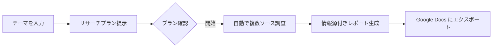

# Gemini Deep Research

## 概要

Deep Research は、Gemini が複数の情報源を自動的に調査し、包括的なレポートを作成する機能です。

## 使い方

1. Gemini を開く（[gemini.google.com](https://gemini.google.com)）
2. モデルを **Gemini 2.5 Pro (Deep Research)** に切り替える
3. 調べたいテーマをプロンプトとして入力する
4. Gemini がリサーチプランを提示するので、内容を確認して「開始」をクリック
5. 数分待つと、情報源付きの詳細レポートが生成される

## 活用例

- 技術選定の比較調査
- 論文やドキュメントの要約・横断調査
- 市場調査やトレンド分析

## ポイント

- プロンプトは具体的に書くほど精度が上がる
- 生成されたレポートは Google Docs にエクスポート可能
- 情報源のリンクが付くので、ファクトチェックがしやすい
