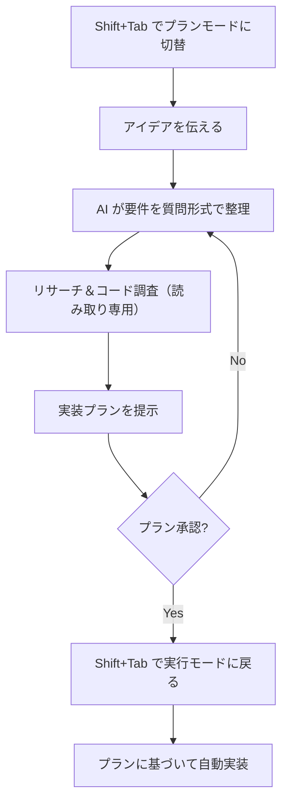

# Kiro CLI vs Claude Code CLI チートシート

## 基本操作

| 操作 | Kiro CLI | Claude Code |
|---|---|---|
| 起動 | `kiro` / `kiro-cli chat` | `claude` |
| ワンショット実行 | `kiro-cli chat "..."` | `claude -p "..."` |
| 非対話モード | `kiro-cli chat --no-interactive "..."` | `claude -p "..."` |
| パイプ入力 | — | `cat file \| claude -p "explain"` |
| 最小起動（高速） | — | `claude --bare` |

## セッション管理

| 操作 | Kiro CLI | Claude Code |
|---|---|---|
| セッション保存 | `/chat save` | 自動保存 |
| 直近を再開 | `--resume` / `-r` | `--continue` / `-c` |
| ID指定で再開 | `--resume-id <ID>` | `--resume <ID>` |
| 名前付きセッション | — | `--name <name>` → `--resume <name>` |
| セッション選択 | `--resume-picker` | `--resume`（ピッカー表示） |
| 一覧表示 | `--list-sessions` / `-l` | セッション名で管理 |
| 新規開始 | `/chat new` | `/clear` |
| 履歴圧縮 | `/compact` | `/compact` |

## モデル・設定

| 操作 | Kiro CLI | Claude Code |
|---|---|---|
| モデル選択 | `--model <id>` / `/model` | `--model <id>` |
| モデルエイリアス | — | `sonnet`, `opus`, `haiku` 等 |
| フォールバック | — | `--fallback-model sonnet,haiku` |
| エフォートレベル | `--effort low\|medium\|high\|xhigh\|max` | `--effort low\|medium\|high\|xhigh\|max` |
| ヘルプ | `kiro --help` | `claude --help` |

## コンテキスト・ファイル

| 操作 | Kiro CLI | Claude Code |
|---|---|---|
| ファイル参照 | パスを会話中に記述 | パスを会話中に記述 |
| ディレクトリ指定 | 起動時の CWD | `--add-dir` で複数ディレクトリ追加可 |
| コンテキスト追加 | `/context` コマンド | `@file` 記法 |

## 権限・ツール管理

| 操作 | Kiro CLI | Claude Code |
|---|---|---|
| 全ツール自動承認 | `--trust-all-tools` / `-a` | `--dangerously-skip-permissions` |
| 特定ツール承認 | `--trust-tools <list>` | `--allowedTools <list>` |
| 特定ツール拒否 | エージェント設定で `deniedCommands` | `--disallowedTools <list>` |
| 権限モード | — | `--permission-mode plan\|auto\|default` |

## 開発ワークフロー

| 操作 | Kiro CLI | Claude Code |
|---|---|---|
| コード生成 | 自然言語で指示 | 自然言語で指示 |
| ファイル編集 | 自動で編集・適用 | 自動で編集・適用 |
| コマンド実行 | ツール経由で自動実行 | ツール経由で自動実行 |
| Git操作 | 組み込みサポート | 組み込みサポート |
| AWS操作 | 組み込み `use_aws` ツール | MCP経由で拡張 |
| ブラウザ操作 | — | `--chrome` で統合 |
| バックグラウンド実行 | — | `--bg` でデタッチ実行 |
| ワークツリー分離 | — | `--worktree` / `-w` |

## 主な違い

| 観点 | Kiro CLI | Claude Code |
|---|---|---|
| 提供元 | Amazon (AWS) | Anthropic |
| 強み | AWS統合、スペック駆動開発 | 汎用性、エコシステムの広さ |
| マルチエージェント | サブエージェント（DAGパイプライン） | Agent Teams / `.claude/agents/*.md` |
| プランニング | `/plan` or `Shift+Tab` | `--permission-mode plan` |
| スキル | `.kiro/skills/**/SKILL.md` | `.claude/skills/<name>/SKILL.md` |
| フック | エージェント設定の `hooks` | `settings.json` の `hooks` |
| 構造化出力 | — | `--json-schema` |
| リモートセッション | — | `--remote` (claude.ai 連携) |

## モード切り替え（Shift+Tab）

| 操作 | Kiro CLI | Claude Code |
|---|---|---|
| モード切り替え | `Shift+Tab` でトグル | なし（権限モードで制御） |
| プランモード | `Shift+Tab` or `/plan` | `--permission-mode plan` |
| 実行モードに戻る | `Shift+Tab` で戻る | 会話中に承認して実行 |

### Kiro CLI のモード詳細

| モード | 説明 | できること |
|---|---|---|
| **実行モード (default)** | 通常のコーディングエージェント | ファイル編集、コマンド実行、全ツール利用可 |
| **プランモード (plan)** | 設計・計画に特化 | コード読み取り・調査のみ（書き込み不可） |

### プランモードのワークフロー



### 設計思想の違い

| 観点 | Kiro CLI | Claude Code |
|---|---|---|
| 計画と実行 | 明確にモード分離（書込不可） | 権限モードで制御（提案→承認） |
| 安全性 | プランモードは完全読取専用 | plan モードでも承認すれば実行可 |
| ワークフロー | 計画→承認→切替→実行 | 同一セッションで分析→提案→承認→実行 |

## 設定ファイルの配置場所

### ルール / 指示ファイル

| 用途 | Kiro CLI | Claude Code |
|---|---|---|
| プロジェクトルール | `.kiro/steering/*.md` | `CLAUDE.md` / `.claude/CLAUDE.md` |
| グローバルルール | `~/.kiro/steering/*.md` | `~/.claude/CLAUDE.md` |
| ローカル（個人用） | — | `CLAUDE.local.md`（gitignore） |
| トピック別ルール | steering 内を分割 | `.claude/rules/*.md` |
| パス限定ルール | `inclusion: fileMatch` | rules の YAML frontmatter で `paths` 指定 |
| インポート構文 | — | `@path/to/file`（最大4段階） |

**Kiro の Steering ファイル例:**
```markdown
# .kiro/steering/coding-standards.md
- snake_case を使う
- public 関数にはドキュメントコメント必須
- Result を返す（panic しない）
```

**Claude Code の CLAUDE.md 例:**
```markdown
# CLAUDE.md（200行以内推奨）
- snake_case を使う
- public 関数にはドキュメントコメント必須

@.claude/rules/rust-conventions.md
```

### MCP サーバー設定

| スコープ | Kiro CLI | Claude Code |
|---|---|---|
| グローバル | `~/.kiro/settings/mcp.json` | `~/.claude.json` 内 |
| プロジェクト | `.kiro/settings/mcp.json` | `.mcp.json`（プロジェクトルート） |
| エージェント内 | `.kiro/agents/<name>.json` の `mcpServers` | — |
| CLI指定 | — | `--mcp-config <file>` |

### Skill（再利用可能プロンプト）

| 用途 | Kiro CLI | Claude Code |
|---|---|---|
| 配置場所 | `.kiro/skills/**/SKILL.md` | `.claude/skills/<name>/SKILL.md` |
| グローバル | `~/.kiro/skills/**/SKILL.md` | `~/.claude/skills/<name>/SKILL.md` |
| 呼び出し方 | オンデマンド（`skill://`） | `/name` でスラッシュコマンドとして実行 |
| フロントマター | `name`, `description` 必須 | `name`, `description` 必須 |

### エージェント設定

| スコープ | Kiro CLI | Claude Code |
|---|---|---|
| ローカル | `.kiro/agents/<name>.json` | `.claude/agents/<name>.md` |
| グローバル | `~/.kiro/agents/<name>.json` | `~/.claude/agents/<name>.md` |
| 形式 | JSON（tools, hooks, MCP等） | Markdown（プロンプト中心） |
| カスタムショートカット | `"keyboardShortcut": "ctrl+shift+a"` | — |

### ディレクトリ構造まとめ

```
# Kiro CLI
.kiro/
├── steering/          # ルール（常時コンテキスト）
│   └── *.md
├── skills/            # スキル（オンデマンド）
│   └── **/SKILL.md
├── agents/            # カスタムエージェント
│   └── <name>.json
└── settings/
    ├── cli.json       # CLI設定
    └── mcp.json       # MCP サーバー設定

# Claude Code
.claude/
├── CLAUDE.md          # プロジェクト指示
├── settings.json      # 権限・フック・設定
├── settings.local.json # 個人設定（gitignore）
├── rules/             # トピック別ルール
│   └── *.md
├── skills/            # スキル
│   └── <name>/SKILL.md
├── agents/            # サブエージェント定義
│   └── *.md
└── commands/          # カスタムコマンド
    └── *.md
.mcp.json              # MCP サーバー設定
CLAUDE.md              # プロジェクトルール（ルート）
CLAUDE.local.md        # 個人ルール（gitignore）
```
