# 育成計画: その他・基礎

| 更新日 | バージョン | 更新者 | 更新内容 |
|--------|-----------|--------|----------|
| 2024年3月31日 | 初版 | Author A | 初版作成 |
| 2024年4月4日 | ver1.1 | Author B | ・こころ構えに「作業時に意識すること」を追加 ・「ネットワークとは」を追加 |

## こころ構え

### 勉強の世界観

- 参考: [元ヤフーエンジニア社長が考える、未経験エンジニアの最適な勉強時間](https://qiita.com/) 
- 小さな疑問を大事にすると成長に繋がる
- エンジニアは毎月1冊以上は本を買って読んでる人が多い
- 自分で調べて試すのが普通。自宅でよく触ってる人は結構いる
- オープンソース = タダでいろいろできる世界。自分次第で何でもできる

### 資格の話

- 専門学校: 卒業するまでに1つ、2つ取る
- プロの世界: **3ヶ月で1つ**資格を取るスピード感。自分で参考書買って自分で取る

### よい姿勢

- とにかく手を動かしてみる
- 文献は2割、実際にやってみるが8割
- 壊しても誰も迷惑がかからない環境があるとよい

### 会社での話

- この先エンジニアとして食っていく為にどうすべきか？を考える
- 石橋を叩くより、まず触れてみたほうが力がつく
- ヤフー「迷ったらワイルドな方を選べ」
- 「許可を求めるな、謝罪せよ」の精神
  - サービスに影響するとかセキュリティ事故に関わることは除外
- 「確認する」よりも「俺ならどうする」を先に考える

### 資格

- **ITパスポート**: 自分の基礎力をあげるために取る
- **LinuC / LPIC**

### 作業時に意識すること

ITエンジニアのプロとして作業にあたる（適当な作業はしない）

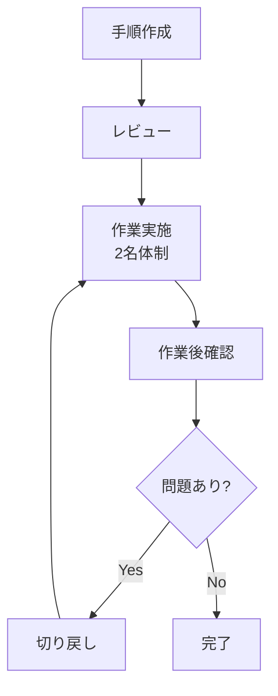

#### 準備する

- 手順をコマンドレベルで記載する
- 手順に切り戻し方法も含める（問題があった場合速やかに対応できるように）
- 作業前後の確認を意識する
  - ファイルであれば `diff` で差分をチェック
  - ansibleであれば `-C` つきで差分を確認
- レビューを受ける（有識者のレビューを受け、手順に誤りがないことを確認）

#### 作業する

- 本番作業は2名体制で実施する
- 問題発生時に切り戻す体制を整える

#### 作業後

- playbookを流しておわりではなく、流した結果の動作を確認する
- 既存サービスへの追加作業であれば、既存サービスに影響を与えていないことを確認する

## インフラとは

- **社会インフラ** (インフラストラクチャー): 電気、水道、ガスなど、社会を支える公共設備
- **ITインフラ**: ITに特化した設備（パソコン、サーバ、ネットワーク機器、ストレージ、OS、LANなど）

参考: https://digital-shift.jp/flash_news/s_210201_11

## ITエンジニアの種類

めちゃめちゃ大雑把に分類すると…

- **プログラマー**: プログラムをつくる人
- **インフラエンジニア**: インフラを整備、管理する人

## 初期のうちに知っておくこと

### コンピュータの構成

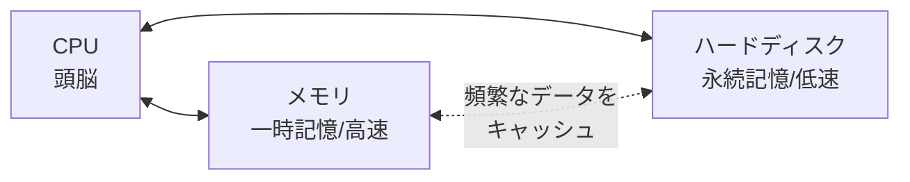

#### CPU

- 命令を計算処理するための頭脳
- かしこいほうが、そりゃ計算がはやい
- スーパーコンピューター: これが、えげつないやつ

#### メモリ (Memory)

- 8ギガバイトとかいうサイズ
- ハードディスクにくらべて、単純に価格が高い。が、爆速
- 一時的に記憶するもの
  - 毎回ハードディスクに、データを取りにいくと時間がかかるので、メモリが頻繁にアクセスするものを一時的に記憶してくれる
  - PCの電源を落とすとここで記憶したものは消える（**揮発性メモリ**という）
- 単純にデータを読み込む速度が爆速

::: tip 速度のイメージ
| 記憶媒体 | アクセス速度 | たとえ |
|---------|------------|--------|
| メモリ (RAM) | ナノ秒 (10⁻⁹秒) | 机の上の本を開く |
| SSD | マイクロ秒 (10⁻⁶秒) | 隣の部屋の本棚から取る |
| HDD | ミリ秒 (10⁻³秒) | 図書館まで歩いて取りに行く |

メモリはHDDの約10万倍速い。だからよく使うデータはメモリに置いておく。
:::

#### データの単位

1. **bit（ビット）** → 1byte は、8bit
2. **Byte（バイト）** ↓ 1024
3. **Kilobyte (KB)**
4. **Megabyte (MB)**
5. **Gigabyte (GB)**
6. **TeraByte (TB)**

「Bit」は、デジタルデータを扱う最小単位であり、「0」または「1」の二つの値を示す情報の形を表現します。

「Byte」は、「8 bits」を一つのまとまりとして表すために使用されます。一桁の数値や、アルファベット一文字を格納するのに十分な容量があります。

大まかな規模感:

- テキストファイル1つ（約1ページ）：約2KB
- 写真1枚（スマホで撮影）：約5MB
- 2時間の映画1本（HD画質）：約1GB以上

つまり、1GBの空き容量があれば、大体300枚の写真、あるいは1本のHD映画を保存できます。

1TB (テラバイト)は1024GBで、大量のデータを持つPCのハードディスクなどに用いられる単位です。

#### 記憶装置（ハードディスク）

- 250ギガバイトというサイズがある
- ファイルとかデータを書き込むと、記憶してくれる
- PCの電源を落としても、データは消えない

> **たとえ話**
>
> 本棚 = ハードディスク、机 = メモリ
>
> 脳味噌さんが、あの選手のデータがほしい → 机にある本をパッと開く → ここにない本は、わざわざ本棚に探して取りにいく

## ハードウェアとソフトウェア

### ハードウェア

物理的に存在する機械（サーバ、ネットワーク機器、マウス、プリンターなど）

### ソフトウェア = プログラム

重さがないもの。ハードウェア上で稼働する目に見えないもの（アプリケーション、ゲームなど）

## OS (Operating System)

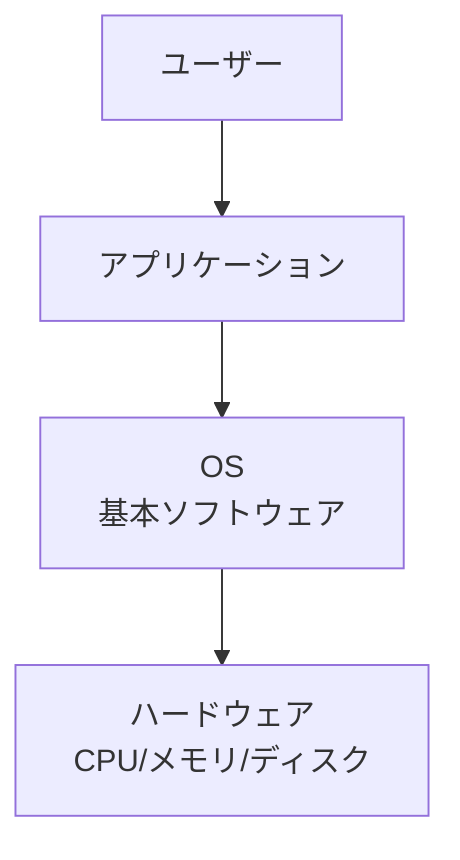

- **基本ソフトウェア**: ハードウェアとユーザやアプリケーションをつなぐ
- **アプリケーション**: OS上で稼働するシステム

### Windows と Unix

| 種類 | 特徴 |
|------|------|
| Windows / Mac | GUI（画面）で操作、見た目でわかりやすい、リソース食い |
| Unix系 | 長時間稼働するサーバやネットワーク機器によく使われる。CUI(CLI)が多い |

Unix の親戚に Linux（ubuntu/centosなど）がある。

### ミドルウェア

OSの上で動くソフト（OSが無いと動かない）。OSとアプリケーションの間に位置する。

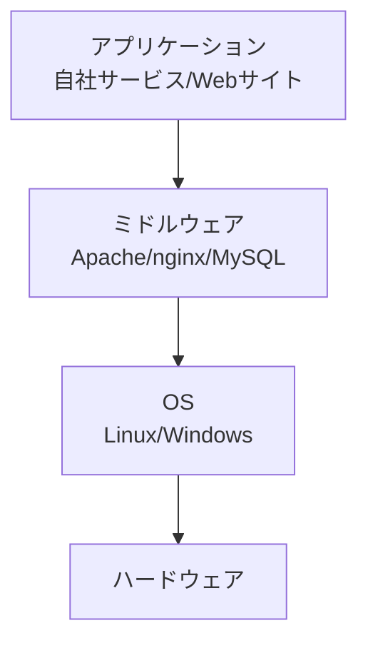

| 種類 | 代表的なミドルウェア | 役割 |
|------|---------------------|------|
| Webサーバー | Apache, nginx | HTTPリクエストを受けてページを返す |
| データベース | MySQL, MariaDB, PostgreSQL | データを保存・検索する |
| キャッシュ | Redis, Memcached | 頻繁にアクセスされるデータを高速に返す |

> 一般的に「ミドルウェア」と聞くと上記のようなサーバーソフトを指すことが多い。slack, word, zoom なども広義にはOSの上で動くソフトウェアだが、これらは「アプリケーション」と呼ばれることが多い。

## パソコンとサーバーの違い

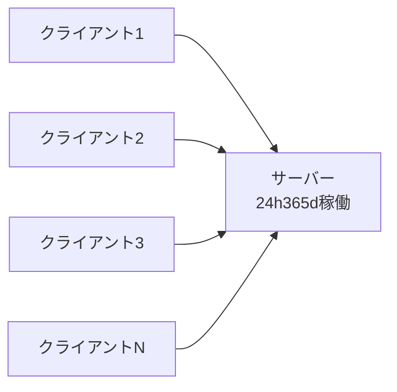

### サーバー

- サーバーを利用する人（提供を受ける人）のことを**クライアント**という
- 24時間365日電源を入れっぱなしにしても安定的に稼動し続ける
- 冗長化されている（電源など壊れやすい部位は2個づつある）
- 1台で10人〜数千人が利用する想定

> **たとえ話**: ビールサーバー = ビールという液体をサービス(提供)している。ビールジョッキ = 利用者

### パソコン

- 基本的には使いたいときに電源を入れる
- 一人、1台


## インフラの基本要素

### OSS (Open Source Software)

- 無料で誰でも使うことができる
- ソースコード（プログラムの中身）が公開されているので、誰でも読める・改良できる
- そのかわり、聞く宛てが無い（自分で調べてどうにかする）
- 商用ソフトにはサポート窓口があるが、OSSはコミュニティ（掲示板やGitHub）で自力で解決する

> **OSSの例**: Linux, Apache, nginx, MySQL/MariaDB, Python, Git, Docker, Kubernetes, Ansible, Terraform...

### プラットフォーム

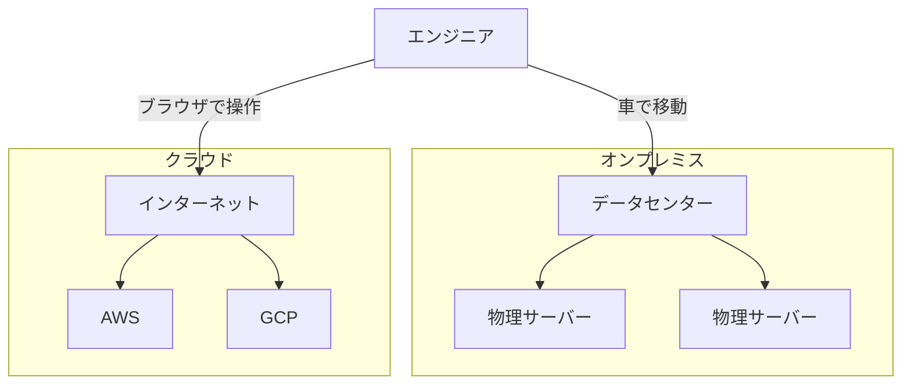

#### オンプレミス（オンプレ）

- データセンターを借りて、そこにハードウェアを設置してサービスする
- 物理的に社屋に到達できる

#### クラウド

- インターネット上にある、データセンタを借りるイメージ
- ブラウザで、ポチポチやれば、OSが構築できる
- **AWS** (Amazon Web Service)
- **GCP** (Google Cloud Platform)
- その他: Azure, Oracle Cloud, 国産(fujitsu, sakura, IDCF)

#### 仮想マシン環境

- Windows: WSL
- Linux: vmware, vcenter, proxmox(OSS)
- AWS/GCP: EC2

### IaC (Infrastructure as Code)

- IaC が無い世界: 人間がコマンドとか命令を逐次出して設定する
- IaC: プログラムのようなもので一括で設定する

::: tip IaCのメリット
- **再現性**: 同じコードを実行すれば、同じ環境ができる
- **バージョン管理**: Gitで変更履歴を追える（いつ誰が何を変えたか）
- **レビュー可能**: コードなので、他の人がチェックできる
- **大量展開**: 100台のサーバーでも1回のコマンドで同じ設定ができる
:::

代表的なIaCツール:
| ツール | 用途 |
|--------|------|
| Ansible | サーバーの構成管理（OSの設定、パッケージ導入など） |
| Terraform | クラウドリソースの作成・管理（EC2、VPCなど） |
| CloudFormation | AWS専用のIaCツール |

### CI/CD

継続的インテグレーション/継続的デリバリー。全自動でやります。


| 用語 | 意味 | やること |
|------|------|---------|
| CI (Continuous Integration) | 継続的インテグレーション | コードを変更したら自動でビルド＆テストが走る |
| CD (Continuous Delivery) | 継続的デリバリー | テストに通ったら自動で本番環境にデプロイされる |

> **なぜ必要？** 手動だとミスが起きる。ノード数が多い環境を毎回手動で更新するのは現実的ではない。CIで品質を担保し、CDで安全にリリースする。

### スケールアップとスケールアウト

両方とも目的としては出力を上げること。

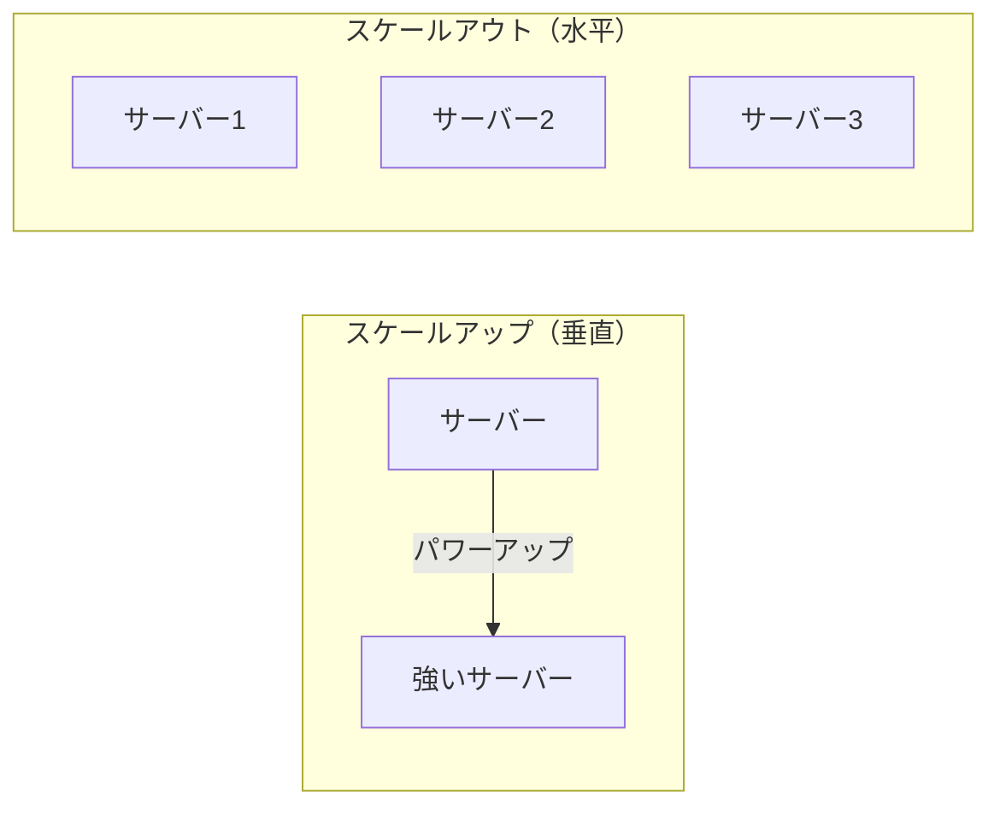

| 種類 | 説明 | 別名 |
|------|------|------|
| スケールアップ | パワーアップ（CPUやメモリを増強） | 垂直スケール |
| スケールアウト | 仲間を増やす（サーバー台数を増やす） | 水平スケール |

## 接続ツール

### SSH (Secure SHell)

- LinuxというOSにリモート接続するための手段
- コマンドベース（CUI）
- SSHクライアント: WSL (Windows Subsystem for Linux) を使うのが良い

```bash
# 基本的な接続方法
ssh ユーザ名@接続先IPアドレス

# 例
ssh ubuntu@192.168.1.100

# 鍵認証で接続（パスワードの代わりに鍵ファイルを使う）
ssh -i ~/.ssh/my_key.pem ubuntu@192.168.1.100
```

::: tip SSH鍵認証とは
パスワードの代わりに「秘密鍵」と「公開鍵」のペアで認証する仕組み。
- **公開鍵**: 接続先サーバーに置く（鍵穴にあたる）
- **秘密鍵**: 自分のPCに持っておく（鍵にあたる）

パスワードよりも安全で、自動化にも向いている。
:::

#### SSHキーペアの作成

```bash
# 一般ユーザで実行
ssh-keygen

# 対話的に以下を聞かれる:
# 1. ファイル保存場所（デフォルト: ~/.ssh/id_rsa）
# 2. パスフレーズ（キーペアに付与するパスワード。空Enterでなしも可）
# 3. パスフレーズの確認
```

生成されるファイル:
| ファイル | 種類 | 扱い |
|---------|------|------|
| `~/.ssh/id_rsa` | 秘密鍵 (プライベートキー) | 自分だけの秘密。外部に漏らさない |
| `~/.ssh/id_rsa.pub` | 公開鍵 (パブリックキー) | SSH接続したいサーバーやGitHubに置く |

#### ~/.ssh/config の活用

SSH接続を便利にする設定ファイル。毎回長いコマンドを打たなくてよくなる。

```bash
# ~/.ssh/config に以下を記載
Host ochiai-ubuntu
  User ubuntu
  HostName 192.168.243.157
  IdentityFile ~/.ssh/y_ochiai.key
```

設定すると:

```bash
# before: 毎回これを打っていた
ssh -i ~/.ssh/y_ochiai.key ubuntu@192.168.243.157

# after: これだけでよい
ssh ochiai-ubuntu
```

メリット:
- `Tab` キーでホスト名を補完できる（これだけで価値がある）
- プロキシ経由の設定も書ける
- ユーザ名・鍵の指定を自動化できる

### WSL (Windows Subsystem for Linux)

WindowsのPC上でLinuxを動かす仕組み。これを使えば、Windowsから離れることなくLinuxのコマンドやSSH接続ができる。

```powershell
# WSLのインストール（PowerShellで実行）
wsl --install
```

### RDP (リモートデスクトップ)

- WindowsというOSにリモート接続
- GUI（マウスでポチポチ）
- Windowsに標準搭載されている「リモートデスクトップ接続」アプリを使う
- 接続先のIPアドレスとユーザ名/パスワードが必要

## こころ構え

### 勉強の世界観

- 参考: [元ヤフーエンジニア社長が考える、未経験エンジニアの最適な勉強時間](https://qiita.com/) 
- 小さな疑問を大事にすると成長に繋がる
- エンジニアは毎月1冊以上は本を買って読んでる人が多い
- 自分で調べて試すのが普通。自宅でよく触ってる人は結構いる
- オープンソース = タダでいろいろできる世界。自分次第で何でもできる

### 資格の話

- 専門学校: 卒業するまでに1つ、2つ取る
- プロの世界: **3ヶ月で1つ**資格を取るスピード感。自分で参考書買って自分で取る

### よい姿勢

- とにかく手を動かしてみる
- 文献は2割、実際にやってみるが8割
- 壊しても誰も迷惑がかからない環境があるとよい

### 会社での話

- この先エンジニアとして食っていく為にどうすべきか？を考える
- 石橋を叩くより、まず触れてみたほうが力がつく
- ヤフー「迷ったらワイルドな方を選べ」
- 「許可を求めるな、謝罪せよ」の精神
  - サービスに影響するとかセキュリティ事故に関わることは除外
- 「確認する」よりも「俺ならどうする」を先に考える

### 資格

- **ITパスポート**: 自分の基礎力をあげるために取る
- **LinuC / LPIC**

### 作業時に意識すること

ITエンジニアのプロとして作業にあたる（適当な作業はしない）


#### 準備する

- 手順をコマンドレベルで記載する
- 手順に切り戻し方法も含める（問題があった場合速やかに対応できるように）
- 作業前後の確認を意識する
  - ファイルであれば `diff` で差分をチェック
  - ansibleであれば `-C` つきで差分を確認
- レビューを受ける（有識者のレビューを受け、手順に誤りがないことを確認）

#### 作業する

- 本番作業は2名体制で実施する
- 問題発生時に切り戻す体制を整える

#### 作業後

- playbookを流しておわりではなく、流した結果の動作を確認する
- 既存サービスへの追加作業であれば、既存サービスに影響を与えていないことを確認する

## Linux 基本コマンド

インフラエンジニアが日常的に使うのは Linux OS（仮想環境が多い）と Terminal（黒い画面。シェルともいう）。

### よく使う最初のコマンド

```bash
pwd          # 今いる場所（カレントディレクトリ）を表示
cd hoge/fuga # ディレクトリ移動
cd           # 引数なしでホームディレクトリに戻る
```

#### ファイル一覧: ls -ltr

```bash
ls -ltr
```

| オプション | 意味 |
|-----------|------|
| `-l` | 詳細表示 |
| `-t` | 最終更新日時順（降順） |
| `-r` | ソート順を逆にする |

::: tip なぜ `ll` ではなく `ls -ltr` か
- `ll` はエイリアスであり、Unix系OS（Solaris等）ではデフォルトで存在しない場合がある
- `-ltr` にすると**最近更新されたファイルが一番下**に来る
- つまり「一番下 = 最近更新があったファイル」。障害時にログを探すとき便利
:::

### システム情報の確認

```bash
# OS（ディストリビューション）の種類 — 最もOS依存しない方法
cat /etc/issue

# カーネルのバージョン
uname -r

# CPUのアーキテクチャ
uname -m
# x86_64  → Intel/AMD 64bit（現在の主流）
# i686    → 32bit x86（古い環境）
# aarch64 → ARM 64bit（ラズパイ、Apple M1等）

# CPUの種類とコア数
cat /proc/cpuinfo

# ディスクの空き容量（ファイルシステムの種類付き）
df -Th
# -T: ファイルシステムのタイプ表示  -h: 人間が読みやすい単位

# 特定ディレクトリの利用量
du -sh ディレクトリ名
# -s: サマリ表示（サブディレクトリを個別表示しない）

# メモリの状況（+ swap）
free -h

# マシンが忙しいかどうか
top
# top 起動中に「1」を入力 → CPUコア別の利用率が見える
```

### ユーザ・グループの確認

```bash
$ id
uid=1000(unixadmin) gid=1000(unixadmin) groups=1000(unixadmin),4(adm),27(sudo)
```

| 項目 | 意味 |
|------|------|
| `uid` | ユーザーID（ユーザーを識別するシステム内部の番号） |
| `gid` | プライマリグループID |
| `groups` | 所属している全グループ |

### ヒアドキュメント

標準入力を使って複数行をファイルに書き込む方法。設定ファイルを作るときに便利。

```bash
# 上書き（既存の内容は消える）
cat > fukusugyo.txt << 'EOF'
1行目の内容
2行目の内容
EOF

# 追記（既存の内容の後ろに追加）
cat >> fukusugyo.txt << 'EOF'
追加する内容
EOF
```

::: warning 注意
`>` が1個だと**上書き**、`>>` だと**追記**。上書きすると元の内容が消えるので注意！
:::

### 補完機能

コマンドの途中まで入力して **TAB** キーを押すと、入力しようとしている文字列を補完してくれる。

### echo

文字列を標準出力する。リダイレクトと組み合わせることが多い。

```bash
echo "hello"             # 標準出力に表示
echo "hello" > file.txt  # ファイルに上書き（なければ新規作成）
echo "hello" >> file.txt # ファイル末尾に追記
```

### nc (netcat)

特定のポートに接続できるか確認する。

```bash
nc -vz 192.168.1.1 3632
# open であればそのportに接続可能
```

### mount

```bash
mount                         # 現在のマウント状態を確認
mount /dev/sda1 /mnt/data     # ブロックデバイスをマウント
```

> `df` はディスクの空きを見るコマンドでブロックデバイスしか見えない。`mount` だけ打つとマウント状態の全体が見える。

### date

```bash
date  # 現在時刻を表示（日本はUTC+9）
```

### chroot

```bash
chroot /mnt/gentoo /bin/bash  # ルートディレクトリを変更してシェルを起動
```

### シェルの種類

```bash
echo $SHELL  # 自分が今使っているシェルを表示
```

| 系統 | シェル | 備考 |
|------|--------|------|
| b系 | sh, bash | 最も一般的 |
| c系 | csh, tcsh | BSD系 |
| k系 | ksh | AIX |
| z系 | zsh | Arch Linux, Kali Linux, Mac |

### ln -s (シンボリックリンク)

```bash
ln -s 元ファイル 作りたいショートカット
ln -sf /usr/share/zoneinfo/Asia/Tokyo /etc/localtime  # -f: 強制上書き
```

### apt (パッケージ管理)

```bash
apt update           # リポジトリのパッケージ一覧を更新
apt search パッケージ名   # パッケージを検索
apt install パッケージ名  # インストール
dpkg -l              # インストール済み一覧（n:次ページ, p:前ページ, q:終了）
```

> リポジトリ = インターネット上にLinuxのパッケージが保管されている場所（10万以上が無料で利用可能）

### ping

```bash
ping example.com  # ネットワーク疎通確認（Ctrl+Cで停止）
```

### cd の補足

```bash
cd ~        # ホームディレクトリに移動（~=チルダ）
cd ..       # 1つ上に移動
cd ../..    # 2つ上に移動
cd -        # 直前の場所に戻る
```

相対指定と絶対指定:
- **絶対指定**: ルート（`/`）からのフルパスで指定 → `cd /opt`
- **相対指定**: 現在のディレクトリを基準に指定 → `cd ../user2`

### ls の補足

```bash
ls -la  # 隠しファイル(.始まり)も含めて詳細表示
```

### w / uptime

```bash
w       # 現在ログインしているユーザーを確認
uptime  # サーバーの稼働時間
```

### su / sudo

```bash
su            # ユーザーを変更
sudo -i       # rootになる（SuperUser DO）
sudo コマンド  # そのコマンドだけroot権限で実行
```

> root = 何でもできる特別なユーザー（神）

### cat

```bash
cat ファイル名  # ファイルの中身を全行出力（viより手軽に確認できる）
```

### netstat

```bash
netstat -ltpn   # サーバーが提供しているポートを表示
netstat -ltpna  # Establish（外部からの接続状況）も表示
```

### grep

```bash
grep 検索文字列 ファイル名       # ファイル内検索
コマンド | grep 検索文字列       # 標準出力から検索
```

| オプション | 意味 |
|-----------|------|
| -n | 行番号を表示 |
| -i | 大文字小文字を区別しない |
| -r | ディレクトリを再帰的に検索 |

### tail

```bash
tail -f ファイル名  # リアルタイムにファイル末尾を監視
```

### rm / rmdir

```bash
rm ファイル名      # ファイル削除
rm -r ディレクトリ  # ディレクトリを中身ごと削除（復活不可、ゴミ箱なし）
rmdir ディレクトリ  # 空のディレクトリのみ削除（安全）
```

### touch

```bash
touch fuga  # 空ファイルを作成
```

### cp

```bash
cp -p 元 先  # 所有者・権限・時刻を保持してコピー
```

### mv (move)

2つの機能: **名前変更** と **移動**

```bash
mv old.txt new.txt        # リネーム
mv ./* /var/www/html/.    # カレントの全ファイルを移動
```

### mkdir

```bash
mkdir hoge  # ディレクトリ作成
```

### systemctl

```bash
systemctl start サービス名    # 起動
systemctl stop サービス名     # 停止
systemctl status サービス名   # 状態確認（active/inactive）
systemctl enable サービス名   # 自動起動ON
systemctl disable サービス名  # 自動起動OFF
systemctl list-unit-files    # 自動起動状態の一覧
```

### ssh

```bash
ssh ユーザー名@接続先
```

### diff

```bash
diff ファイル1 ファイル2      # 変更点を比較
diff -c ファイル1 ファイル2   # フラグ付き表示
diff -bwy ファイル1 ファイル2  # サイドバイサイド表示
vimdiff ファイル1 ファイル2   # リッチな比較表示
```

### passwd

```bash
passwd  # 現在のユーザーのパスワードを変更
```

### fdisk

```bash
fdisk -l  # パーティション・デバイスの状況を確認
```

### パイプ

`|`（パイプ）で前のコマンドの結果を次のコマンドに渡す。grepと組み合わせることが多い。

```bash
ps aux | grep apache         # プロセス一覧からapacheを検索
cat /etc/passwd | grep user1 # ファイル内容から特定文字列を抽出
```

## ネットワーク調査コマンド

### 自ホストのネットワーク設定を確認

```bash
# IPアドレスの確認（Windowsの ipconfig に相当）
ip a
# 出力から inet の行を見る:
#   inet 192.168.243.xxx/24 ← ローカルIP と サブネットマスク

# ゲートウェイ（ルーティングテーブル）の確認
ip r
# または
route -n    # -n: 名前解決をしない（高速）
```

`route -n` の出力例と読み方:

```
Destination     Gateway         Genmask         Flags Iface
0.0.0.0         172.24.192.1    0.0.0.0         UG    eth0    ← デフォルトルート
10.10.10.0      192.168.1.1     255.255.255.0   UG    eth1    ← 特定NW用ルート
172.24.192.0    0.0.0.0         255.255.240.0   U     eth0    ← ローカルサブネット
```

- **デフォルトルート** (0.0.0.0): 宛先不明のトラフィックは全てこのGWを経由
- **ゲートウェイが 0.0.0.0**: GWを経由せず直接通信（同一セグメント内）

#### ipcalc: セグメントの確認

```bash
apt install ipcalc
ipcalc 192.168.100.14/24
ipcalc 192.168.100.14 255.255.255.240
```

ネットマスクによって分割されたネットワークの通信可能範囲（セグメント）をすぐに確認できる。

#### グローバルIPの確認

```bash
# 自分の端末が外に出ていくときのグローバルIP
curl ipconfig.io
curl ifconfig.io
```

### ping: 疎通確認

```bash
ping example.com
# PING example.com (93.184.216.34) 56(84) bytes of data.
# 64 bytes from ...: icmp_seq=1 ttl=236 time=14.6 ms
```

| 項目 | 意味 |
|------|------|
| `time` | 往復時間（RTT）。1ms = 0.001秒 |
| `ttl` | Time To Live。L3機器を1つ経由するごとに1減る。0で破棄（ループ防止） |

::: warning ping が返ってこない ≠ 疎通不可
ファイアウォールがICMPをブロックしていることは普通にある。pingが通らなくてもTCPは通る場合がある。疎通確認は `nc` や `curl` も併用すること。
:::

#### TTLの基礎値

| OS/機器 | TTL基礎値 |
|---------|----------|
| Linux / Unix | 64 |
| Windows | 128 |
| ネットワーク機器 | 255 |

> 例: ttl=102 → 128 - 102 = 26 → Windowsサーバーまで26台のL3機器を経由

### netcat (nc): ポートの疎通確認

```bash
# インストール（openbsd版推奨）
apt install netcat-openbsd

# クライアント: 特定ポートへの疎通確認
nc -vz ドメインまたはIP port

# 例: TCP 20〜100番ポートをスキャン
nc -vz 192.168.243.157 20-100
# Connection to 192.168.243.157 22 port [tcp/ssh] succeeded!
# Connection to 192.168.243.157 80 port [tcp/http] succeeded!
```

| オプション | 意味 |
|-----------|------|
| `-v` | 詳細表示 |
| `-z` | データを送らずに接続確認だけ行う |
| `-l` | サーバーモード（Listen） |
| `-k` | 接続終了後も待ち受けを継続 |

```bash
# サーバー: 簡易的に好きなポートでサーバーを起動（デバッグ用）
nc -lk 8000

# HTTP レスポンスも見たいなら python モジュールで
python3 -m http.server 8080
```

> 特権ポート (0-1023) はroot権限がないとListenできない。

### curl: HTTP通信の調査

HTTPリクエストを送信し、レスポンスを確認するコマンド。

```bash
# 基本: GETリクエスト
curl http://127.0.0.1:8000

# 詳細なデバッグ出力（リクエスト/レスポンスヘッダも表示）
curl -v http://127.0.0.1:8000

# レスポンスヘッダのみ取得
curl -I http://127.0.0.1:8000

# リダイレクト(3xx)を自動フォロー
curl -L http://example.com

# プロキシ経由
curl -x http://proxyserver:port http://example.com

# SSL証明書エラーを無視（自己署名証明書等）
curl -k https://self-signed.badssl.com/

# ステータスコードだけ取得
curl -o /dev/null -s -w "%{http_code}\n" http://127.0.0.1:8080
```

#### よく使うオプション

| オプション | 意味 |
|-----------|------|
| `-v` | 詳細出力（デバッグ） |
| `-I` | HEADリクエスト（ヘッダのみ） |
| `-L` | リダイレクトをフォロー |
| `-x` | プロキシ指定 |
| `-k` | SSL検証を無視 |
| `-H` | カスタムヘッダ追加 |
| `-X` | HTTPメソッド指定 |
| `-d` | POSTデータ送信 |
| `-u user:pass` | ベーシック認証 |
| `-A` | User-Agent指定 |
| `-b` | Cookie送信 |
| `-s` | サイレントモード |
| `-w` | カスタムフォーマット出力 |

#### POST リクエスト

```bash
# フォームデータ
curl -X POST -d "param1=value1&param2=value2" http://127.0.0.1:8000

# JSON データ
curl -X POST -H "Content-Type: application/json" \
  -d '{"key1":"value1", "key2":"value2"}' http://127.0.0.1:8000

# 認証ヘッダ付き
curl -H "Authorization: Bearer YOUR_ACCESS_TOKEN" http://127.0.0.1:8000
```

#### -w で使える変数

| 変数 | 意味 |
|------|------|
| `%{http_code}` | HTTPステータスコード |
| `%{time_total}` | 全体のリクエスト時間（秒） |
| `%{time_namelookup}` | 名前解決にかかった時間 |
| `%{time_connect}` | 接続確立までの時間 |
| `%{time_starttransfer}` | 最初のバイトが転送された時間 |
| `%{size_download}` | ダウンロードされたバイト数 |

## ファイル転送

### プロトコルとは

お互いにやりとりするための共通の言葉（ルール/規約）のこと。

> **たとえ話**: 日本人同士は日本語で会話する。英語圏の人とは英語で会話する。「何語で喋るか」がプロトコルにあたる。コンピュータも通信相手と同じプロトコルを使わないと通じない。

代表的なプロトコルとポート:

| プロトコル | ポート | 何をする？ |
|-----------|--------|-----------|
| HTTP | 80 | Webページを表示する（暗号化なし） |
| HTTPS | 443 | Webページを表示する（暗号化あり） |
| SSH | 22 | リモートで安全にサーバーに接続する |
| FTP | 21 | ファイルを送受信する |
| DNS | 53 | ドメイン名をIPアドレスに変換する |
| SMTP | 25 | メールを送信する |

### ファイル転送プロトコル

| プロトコル | port | 特徴 |
|-----------|------|------|
| ftp | 21 | 古い。暗号化されていない。絶滅寸前 |
| sftp | 22 | 暗号化されている。主流 |
| rsync | - | 同期（sync）ができる。暗号化の有無を選択可能 |
| ftps | 989,990 | ほぼ使っている人はいない |

rsync の同期イメージ:

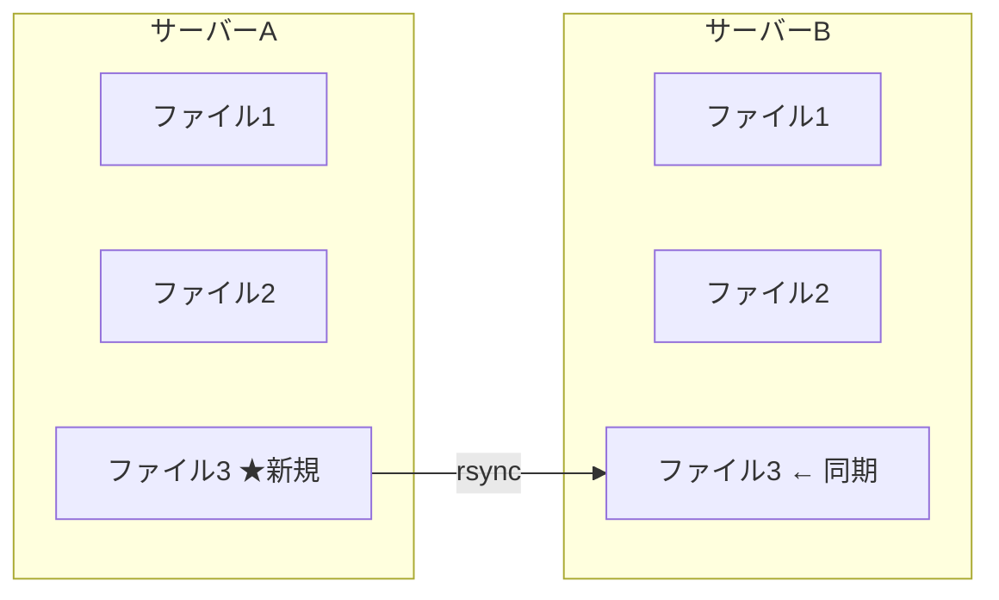

### sftp の使い方

```bash
sftp ubuntu@192.168.243.157
```

- `!` をつけると接続元、つけないと接続先を参照
- `mput ファイル名`: ファイルを送る
- `mget ファイル名`: ファイルを取得する

### GUIソフトウェア

- **WinSCP**: ftp, sftp, ftps どれでも利用可能
- **FFFTP**: ftp, sftp, ftps どれでも利用可能

## サービス・プロセス管理

### netstat: ネットワーク接続の確認

サーバーで「どのポートが開いているか」「誰が接続しているか」を確認する。

```bash
# 基本: リッスンしているTCPポートを表示
netstat -ltpn

# UDP も含める
netstat -ltupn

# 確立済み接続も含めて全て表示
netstat -ltupna
```

| オプション | 意味 |
|-----------|------|
| `-l` | LISTEN状態のソケットのみ |
| `-t` | TCPのみ |
| `-u` | UDPも表示 |
| `-p` | PID/プログラム名を表示 |
| `-n` | ホスト名・ポート名を数値で表示 |
| `-a` | 全ての接続を表示（ESTABLISHEDなども） |

::: warning 一般ユーザ vs root
一般ユーザで実行すると、自分が起動したプロセスしかPID/Program nameが見えない。全プロセスを見るには `sudo` が必要。
:::

#### 出力の読み方

```
Proto Recv-Q Send-Q Local Address       Foreign Address     State       PID/Program name
tcp        0      0 0.0.0.0:80          0.0.0.0:*           LISTEN      1365/apache2
tcp        0      0 127.0.0.1:3306      0.0.0.0:*           LISTEN      1546/mysqld
tcp        0      0 0.0.0.0:22          0.0.0.0:*           LISTEN      1023/sshd
```

| 項目 | 意味 |
|------|------|
| `Proto` | プロトコル (tcp/udp) |
| `Recv-Q` | 受信キュー（通常0。非ゼロが続くとアプリに問題あり） |
| `Send-Q` | 送信キュー（通常0。非ゼロが続くと送信側に遅延あり） |
| `Local Address` | 待ち受けアドレス:ポート |
| `Foreign Address` | 接続元（LISTEN時は `*`） |
| `State` | ソケットの状態 |
| `PID/Program name` | プロセスIDとプログラム名 |

#### Local Address の読み方

| 表示 | 意味 |
|------|------|
| `0.0.0.0:80` | 全インターフェースのport 80で待ち受け（外部からアクセス可能） |
| `127.0.0.1:3306` | ローカルホストのみ。外部からはアクセス不可 |
| `:::80` | IPv6の全インターフェース |

#### State の種類

| State | 意味 |
|-------|------|
| `LISTEN` | 接続を待っている |
| `ESTABLISHED` | 通信中（3ウェイハンドシェイク完了） |
| `SYN_SENT` | 接続要求送信中 |
| `CLOSE_WAIT` | クローズ待ち |
| `TIME_WAIT` | 接続終了後の待機 |

### lsof: ファイル/ポートを使っているプロセスの特定

「このファイル/ポートを使っているのは誰？」を調べる。

```bash
# 特定のファイルを開いているプロセスを表示
sudo lsof /var/log/apache2/access.log

# 特定のポートを使っているプロセスを表示
sudo lsof -i :80
# COMMAND     PID     USER   FD   TYPE   DEVICE SIZE/OFF NODE NAME
# apache2  316077 www-data    4u  IPv6 52882782      0t0  TCP *:http (LISTEN)

# 特定プロセスが開いている全ファイル
sudo lsof -p PID
```

> `sudo` をつけないと一般ユーザが確認できる範囲は限られる。

### ps: プロセスの確認

#### ps auxw — リソース使用率を確認

```bash
ps auxww    # ww で長いコマンドも切れない
```

| カラム | 意味 |
|--------|------|
| `USER` | プロセスの所有者 |
| `PID` | プロセスID |
| `%CPU` | CPU使用率 |
| `%MEM` | メモリ使用率 |
| `VSZ` | 仮想メモリサイズ |
| `RSS` | 実メモリ使用量 |
| `STAT` | プロセスの状態 |
| `START` | 開始時刻 |
| `TIME` | CPU使用時間累計 |
| `COMMAND` | 実行コマンド |

#### ps -ef — 親子関係を確認

```bash
ps -ef
```

| カラム | 意味 |
|--------|------|
| `UID` | 所有者 |
| `PID` | プロセスID |
| `PPID` | **親プロセスID** |
| `C` | CPU使用率 |
| `STIME` | 開始時刻 |
| `CMD` | 実行コマンド |

#### pstree: プロセスのツリー表示

```bash
# インストール
apt install psmisc

# 特定PIDの子プロセスをツリー表示
pstree -p 3449791
# apache2(3449791)─┬─apache2(316077)─┬─{apache2}(316080)
#                  │                 ├─{apache2}(316082)
```

## パーミッション（ファイル権限）

### ファイルの見方

```bash
ls -l
# drwxr-xr-x  17 unixadmin unixadmin   4096 May  1 16:15 myproject
# -rw-r--r--   1 unixadmin unixadmin     54 May 16 11:27 helloworld.py
```

#### パーミッション文字列の読み方

```
d rwx r-x r-x
│  │   │   └── その他ユーザーの権限
│  │   └────── グループの権限
│  └────────── 所有者の権限
└───────────── ファイルタイプ (d=ディレクトリ, -=通常ファイル)
```

| 文字 | 意味 | 数値 |
|------|------|------|
| `r` | 読み取り (read) | 4 |
| `w` | 書き込み (write) | 2 |
| `x` | 実行 (execute) | 1 |
| `-` | 権限なし | 0 |

#### 数値表現

各桁を足し算する:
- `rwx` = 4+2+1 = **7**
- `r-x` = 4+0+1 = **5**
- `r--` = 4+0+0 = **4**

よく見るパターン:
| 数値 | 文字 | 用途 |
|------|------|------|
| `755` | `rwxr-xr-x` | 実行ファイル、ディレクトリ |
| `644` | `rw-r--r--` | 一般的なファイル |
| `600` | `rw-------` | 秘密鍵など機密ファイル |
| `777` | `rwxrwxrwx` | 全員全権限（基本使わない。セキュリティリスク） |

### chmod: 権限の変更

```bash
# 数値指定（絶対値）
chmod 755 script.sh      # rwxr-xr-x
chmod 644 config.txt     # rw-r--r--

# 記号指定（相対値）
chmod g+r hoge           # グループに読み取り権限を追加
chmod o-w hoge           # その他ユーザーから書き込み権限を削除
chmod u+x script.sh      # 所有者に実行権限を追加
```

| 対象 | 意味 |
|------|------|
| `u` | 所有者 (user) |
| `g` | グループ (group) |
| `o` | その他 (other) |
| `a` | 全員 (all) |

`+` で追加、`-` で削除。

### chown: 所有者・グループの変更

```bash
# 所有者を変更
sudo chown newuser file.txt

# グループを変更
sudo chown :newgroup file.txt

# 所有者とグループを同時に変更
sudo chown newuser:newgroup file.txt

# ディレクトリ以下を再帰的に変更
sudo chown -R newuser:newgroup /path/to/dir
```

::: warning 注意
一般ユーザーは他人のファイルの所有者を変更できない（root/sudo が必要）。これはセキュリティ上の理由。自分のファイルの所有者を他人に変更されると、そのファイルを削除・変更されてしまうため。
:::

### ファイルシステムへの書き込みテスト

「書き込めるかどうか」を確認するシンプルな方法:

```bash
touch hoge.txt    # 空ファイルを作成してみる
# 成功すればファイルシステムは書き込み可能
# "Read-only file system" エラーが出れば書き込み不可
```

## sudo: 管理者権限の実行

### sudo が使える条件

`/etc/sudoers` ファイルの設定による。

```bash
# 自分がどのコマンドをsudoで実行できるか確認
sudo -l
```

#### /etc/sudoers の書式

```
user(または %group)  host=(runas_users:runas_groups)  commands
```

#### 設定例

```bash
# rootは全て実行可能
root    ALL=(ALL:ALL) ALL

# sudoグループのメンバーは全コマンド実行可能
%sudo   ALL=(ALL:ALL) ALL

# user1にパスワードなしで全コマンドを許可
user1   ALL=(ALL) NOPASSWD: ALL

# user1にApacheの再起動だけを許可
user1 ALL=(root) NOPASSWD: /usr/sbin/service apache2 restart

# user2にログの閲覧だけを許可
user2 ALL=(root) NOPASSWD: /usr/bin/tail /var/log/*
```

## ログの見方

### 便利なコマンド

#### less: ファイルの閲覧

```bash
less /var/log/syslog
less -S /var/log/syslog    # -S: 長い行を改行しない
less -N /var/log/syslog    # -N: 行番号を表示
```

#### tail: ファイル末尾の表示

```bash
tail filename       # デフォルトで最後の10行を表示
tail -f filename    # リアルタイムでファイルの更新を表示（ログ監視に必須）
tail -n 50 filename # 最後の50行を表示
```

#### grep: パターン検索

```bash
grep 'error' /var/log/syslog           # errorを含む行を表示
grep -i 'error' /var/log/syslog        # 大文字小文字を区別しない
grep -r 'pattern' /path/to/dir         # サブディレクトリも含めて再帰検索
grep -c 'error' /var/log/syslog        # マッチした行数を表示
grep -v 'debug' /var/log/syslog        # debugを含まない行を表示
```

#### awk: テキスト処理

フィールド（列）を指定して抽出・加工するコマンド。ログ解析に強い。

```bash
# 特定フィールドを抽出（apacheアクセスログからIPとステータスコード）
awk '{print $1, $9}' access.log
# 172.24.192.1 200
# 172.24.192.1 404

# 条件でフィルタリング（ステータスコード200の行のみ）
awk '$9 == 200 {print $0}' access.log

# 合計を算出（レスポンスサイズの合計）
awk '{sum += $10} END {print sum}' access.log

# 区切り文字を変更（CSV処理）
awk -F',' '{print $2}' data.csv
# -F: フィールド区切り文字（デフォルトはスペース/タブ）
```

### 便利なシェル操作（ターミナルショートカットキー）

ターミナルのショートカットキーはデフォルトで **emacs のキーバインド**と同じ。覚えればemacsでもそのまま使える。

#### カーソル移動

| キー | 動作 | 備考 |
|------|------|------|
| `Ctrl + b` | ←（左に1文字移動） | 矢印キー←と同じ |
| `Ctrl + f` | →（右に1文字移動） | 矢印キー→と同じ |
| `Ctrl + a` | 行頭に移動 | 長いコマンドの先頭に戻る |
| `Ctrl + e` | 行末に移動 | 行頭で修正後に行末に戻る |
| `Ctrl + p` | 一つ前の履歴 | 矢印キー↑と同じ |
| `Ctrl + n` | 一つ後の履歴 | 矢印キー↓と同じ |

#### 文字列削除

| キー | 動作 | 備考 |
|------|------|------|
| `Ctrl + d` | カーソル位置の文字を削除 | Deleteキーと同じ。空行で押すとログアウト |
| `Ctrl + h` | カーソルの1文字前を削除 | Backspaceと同じ |
| `Ctrl + u` | 行頭まで削除 | カーソルから左を全削除 |
| `Ctrl + k` | 行末まで削除 | カーソルから右を全削除 |
| `Ctrl + w` | 単語単位で左を削除 | スペース区切りで1単語消す |
| `Ctrl + y` | 削除した文字列を貼り付け (yank) | Ctrl+k/u で消したものを戻す |

#### その他

| キー | 動作 | 備考 |
|------|------|------|
| `Ctrl + c` | 実行中のコマンドを中断 | 強制終了 |
| `Ctrl + r` | コマンド履歴を検索 | 文字入力で部分一致検索。Enter で実行、Esc で編集モード |
| `Ctrl + l` | 画面クリア | ターミナルをリセットして見やすくする |

::: tip Ctrl + d の多段ログアウト
ssh接続、mysql接続、docker exec 等、多段で接続しているものを終了するとき、`exit` を連打しなくても `Ctrl + d` で1段ずつ抜けられる。
:::


## Linuxの種類（ディストリビューション）

Linux にも種類がめちゃめちゃ多くある（1000種類くらい？）。オープンソースなので無料のものも多い。

### 有償

- Redhat Linux
- Oracle Linux
- Suse Linux

### 主な系統

| 系統 | 代表的なディストリビューション | 特徴 |
|------|------|------|
| SlackWare系 | - | 歴史があるが最近はあまりみかけない |
| Redhat (Fedora)系 | RHEL, CentOS, Rocky Linux, Alma Linux | データベースを動かすときによく選択される |
| Debian系 | **ubuntu** | 2024年現在もっとも流行っている |
| Gentoo系 | - | もっとも扱いが難しい |
| 独立系 | arch linux | - |

系統の違い = パッケージ管理の方法が違う（基本的なコマンドは一緒）

| 系統 | パッケージ管理コマンド | パッケージ形式 |
|------|---------------------|--------------|
| Redhat系 | `yum` / `dnf` | `.rpm` |
| Debian系 | `apt` | `.deb` |

```bash
# Debian系 (ubuntu) でnginxをインストールする場合
sudo apt update          # パッケージ一覧を最新化
sudo apt install nginx   # nginxをインストール

# Redhat系 (Rocky Linux) の場合
sudo dnf install nginx
```

参考: https://upload.wikimedia.org/wikipedia/commons/1/1b/Linux_Distribution_Timeline.svg

## ネットワークとは

### パケット

コンピュータ間でデータを送受信する際、データは「パケット」という小さな単位に分割されて送られる。

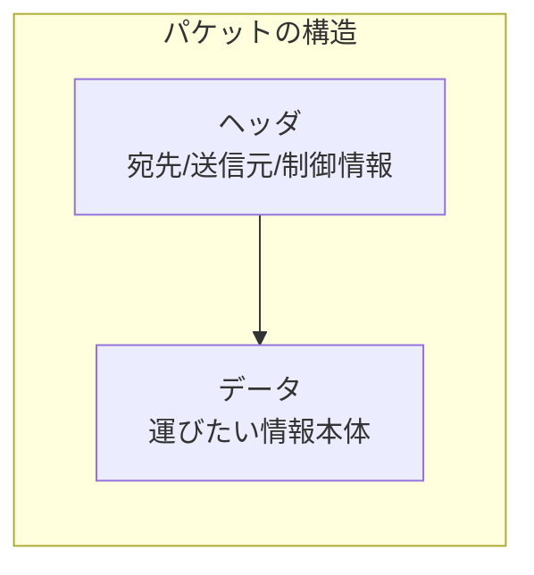

- 大きなファイルも小さなパケットに分割して送る（1つの道路を独占しないように）
- 各パケットにはヘッダ（宛先情報）が付いており、ネットワーク機器がこれを見て正しい宛先に届ける
- 届いた先でパケットを組み立て直して、元のデータに復元する

> **たとえ話**: 長い手紙を1枚ずつハガキに分けて送るようなもの。各ハガキに宛先と何枚目かが書いてあるので、届いた先で順番通りに並べれば元の手紙になる。

### IPアドレス

インターネット上の機器が互いに通信する際に識別するためのアドレス。

- **IPv4**: 約43億個 (2の32乗) — 3桁が4つ、1区切りの最大値が255
- **IPv6**: 約340澗個 (2の128乗)

#### グローバルIPアドレス

- 全世界で一意(uniq)に割り当て
- インターネットに接続するときに必要
- 世界で同じものが1つとして無い（住所と同じ）

> IPv4のグローバルIPは約43億個しかない。大学や大企業が大量に確保してしまい枯渇問題がある。そのためIPv6が生まれた。ただしクラウドの台頭により、現在はそこまで急いで移行する雰囲気ではない。

#### プライベート(ローカル)IPアドレス

企業内、家庭内など閉じられた世界で使用する。インターネットへはグローバルIPへの変換（**NAT**: Network Address Translation）が必要。

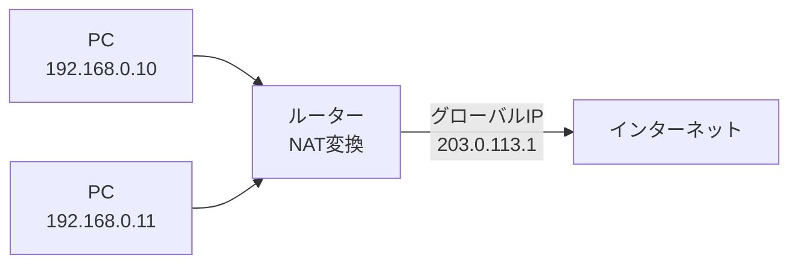

| 範囲 | ブロック |
|------|---------|
| 10.0.0.0〜10.255.255.255 | 24ビットブロック |
| 172.16.0.0〜172.31.255.255 | 20ビットブロック |
| 192.168.0.0〜192.168.255.255 | 16ビットブロック |

#### 特殊なIP

- `127.0.0.1`: 自分自身のホスト専用（他のホストからは通信できない）

### ドメインネーム

IPアドレスを人間がわかりやすいように表現しているもの。

例: `example.com` → `93.184.216.34` など

### DNS (Domain Name System)

ドメインとIPアドレスを変換する仕組み。

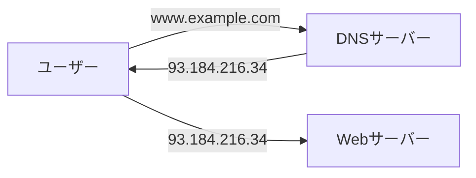

- **正引き**: ドメイン → IPアドレス
- **逆引き**: IPアドレス → ドメイン

#### 名前解決の確認コマンド

```bash
# 基本的な名前解決の確認
dig example.com +search
host example.com
nslookup example.com
```

結果としてIPアドレスが1つ以上出ていれば、名前が引けているということ。

#### リゾルバの設定

リゾルバ = 名前解決に使うDNSサーバーの情報やサーチドメインの設定。

```bash
cat /etc/resolv.conf
# nameserver 192.168.xxx.xxx        ← 参照しているDNSサーバー
# search example.local corp.example.com  ← サーチドメイン
```

```mermaid
graph LR
    Client[クライアント] -->|名前を問い合わせ| Cache[DNSキャッシュサーバー]
    Cache -->|自身で回答| Client
    Cache -->|スタブゾーン: 身内に聞く| Internal[社内DNSコンテンツサーバー]
    Cache -->|フォワードゾーン: 丸投げ| Forward[別のDNSサーバー]
    Cache -.->|上記に無い場合| Root[ルートDNS &#8594; コンテンツサーバー群]
```

::: tip リゾルバが 127.0.0.53 の場合
nameserverが `127.0.0.53` の場合、ローカルのスタブリゾルバが動いている。実際のDNSサーバーを知るには `/etc/resolv.conf` のコメント行にヒントがある:

```bash
# Debian/Ubuntu: resolvectl status
# Mac: scutil --dns
# WSL: 母艦のWindowsに問い合わせている（172.24.192.1等）
```
:::

#### サーチドメイン

FQDNではなく短縮ドメインで入力したとき、自動的にドメインを補完してくれる機能。

```bash
# search example.local corp.example.com が設定されている場合
# "dig server1 +search" で以下を順に試してくれる:
#   server1.example.local
#   server1.corp.example.com
```

> トラブルを回避したい場合は、短縮ドメインではなく**FQDN**で名前を確認するのが確実。

```bash
dig www.example.com
```

### サブネットマスク

IPアドレスを「ネットワーク部」と「ホスト部」に分割するための数値。

> **たとえ話**: 住所でいうと「大阪府大阪市」がネットワーク部（どの地域か）、「○○町1-2-3」がホスト部（その地域のどの家か）にあたる。ネットマスクは「どこまでが地域名で、どこからが個別の家か」の区切りを決めるもの。

覚え方: ネットマスクが `255` のところは「ネットワーク部」、`0` のところは「ホスト部」。ホスト部の範囲が同じセグメント（=直接通信できる仲間）になる。

```bash
# 例1: 172.16.0.1 / 255.255.255.0 (/24)
#   ネットワーク部: 172.16.0
#   ホスト部: .1〜.254
# → 172.16.0.1〜172.16.0.254 が通信可能な範囲 (254台)

# 例2: 172.16.0.1 / 255.255.0.0 (/16)
#   ネットワーク部: 172.16
#   ホスト部: .0.1〜.255.254
# → 172.16.0.1〜172.16.255.254 が通信可能な範囲 (65,534台)

# 便利コマンド
apt install ipcalc
ipcalc 192.168.1.0/24
```

表記方法:
- `255.255.255.0` 形式（サブネットマスク）
- `/24` (CIDR表記) — マスクの `255`(=8bit) が何個あるか。/24 = 8x3 = 上位24ビットがネットワーク部

::: tip よく使うCIDR
| CIDR | サブネットマスク | ホスト数 | 用途例 |
|------|----------------|---------|--------|
| /32 | 255.255.255.255 | 1台 | 特定ホスト指定 |
| /24 | 255.255.255.0 | 254台 | 一般的なLAN |
| /16 | 255.255.0.0 | 65,534台 | 大規模ネットワーク |
| /8 | 255.0.0.0 | 約1,677万台 | 超大規模 |
:::

### ゲートウェイ

異なるネットワークを繋ぐ接続点。GW = ルーター（ルーティングの仕事をする機械）と考えてよい。

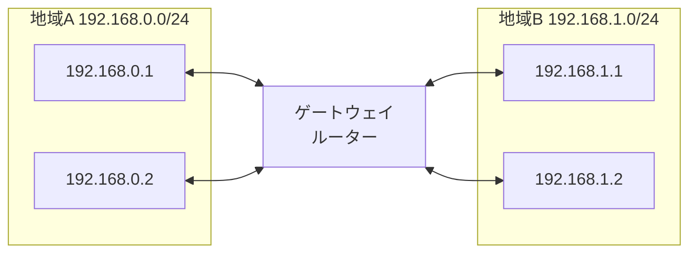

- GWが無くても通信できる範囲 = netmask(CIDR)で指定した範囲
- 異なるセグメント間の通信にはGWが必要

### ブロードキャスト

ネットワーク上の全ての機器に対して一度にデータを送ること。ブロードキャストIPアドレスは予約されており、機器間通信には利用できない。

> **たとえ話**: 教室で先生が「全員聞いて！」と言うのがブロードキャスト。特定の生徒に話しかけるのがユニキャスト（通常の通信）。
>
> 例: `192.168.0.0/24` のネットワークでは `192.168.0.255` がブロードキャストアドレス。この宛先に送ったデータは、そのセグメントの全機器が受け取る。

### ポート

IPアドレスが「建物の住所」だとすると、ポートは「部屋番号」にあたる。1つのサーバー（1つのIPアドレス）で複数のサービスを同時に動かすために、ポート番号で区別する。

| ポート番号 | サービス | 用途 |
|-----------|---------|------|
| 22 | SSH | リモート接続 |
| 80 | HTTP | Webサイト（暗号化なし） |
| 443 | HTTPS | Webサイト（暗号化あり） |
| 21 | FTP | ファイル転送 |
| 25 | SMTP | メール送信 |
| 53 | DNS | 名前解決 |
| 3306 | MySQL/MariaDB | データベース |

well Known Port 一覧: https://www.infraexpert.com/study/tea5.htm

> portが無い世界だったら… 1つのサービスに1つのIPが必要になっていたかも。

::: tip ポート番号の範囲
- **0〜1023**: Well Known Port（有名なサービスが使う予約済みの番号）
- **1024〜49151**: 登録済みポート（アプリケーションが登録して使う）
- **49152〜65535**: 動的ポート（一時的な通信に自動で割り当てられる）
:::

### OSI参照モデル

ネットワークの通信機能を7階層に分けてモデル化。通信の仕組みを理解するための「教科書的な分類」であり、実際の通信はTCP/IPモデル（4層）で動いていることが多い。

| 層 | 名称 | 役割 | 例 |
|----|------|------|-----|
| 7 | アプリケーション層 | アプリの具体的機能 | http, ftp, smtp, dns |
| 6 | プレゼンテーション層 | データの表現形式（暗号化、圧縮） | SSL/TLS, JPEG, gzip |
| 5 | セッション層 | 通信の開始〜終了の管理 | NetBIOS |
| 4 | トランスポート層 | 通信品質コントロール（到達保証） | TCP/UDP |
| 3 | ネットワーク層 | 通信経路の選択・中継（ルーティング） | IP, ICMP |
| 2 | データリンク層 | 直接接続された機器同士の通信 | イーサネット, Wi-Fi |
| 1 | 物理層 | 電気信号・光信号など物理的な通信 | LANケーブル, 光ファイバー |

> **覚え方**: 「あ(7)・プ(6)・セ(5)・ト(4)・ネ(3)・デ(2)・ブ(1)」— 上から順に頭文字を取る。
>
> インフラエンジニアが特に意識するのは L2〜L4 あたり。「L3スイッチ」「L4ロードバランサ」のようにレイヤー番号をつけて呼ぶことが多い。

### TCP/IP

| プロトコル | 層 | 特徴 | 用途 |
|-----------|-----|------|------|
| TCP (L4) | トランスポート層 | 確実にデータを送り届ける。ステートフル | Web, メール, ファイル転送 |
| UDP (L4) | トランスポート層 | すばやく送る。ステートレス。再送制御なし | 音声, 動画ストリーミング, DNS |

::: tip ステートフルとステートレス
- **ステートフル (TCP)**: 「今、通信中ですよ」という状態を双方が覚えている。データが届かなかったら再送する。確実だが遅い。
  - たとえ: 電話（相手が聞いてるか確認しながら話す）
- **ステートレス (UDP)**: 送りっぱなし。届いたかどうか確認しない。速いが不確実。
  - たとえ: 手紙を投函（届いたかは確認しない）

動画通話で一瞬映像が乱れても、前の映像を再送されても意味がない。だからUDPが使われる。
:::

### ロードバランサ

L4またはL7でネットワークの経路を制御する装置。

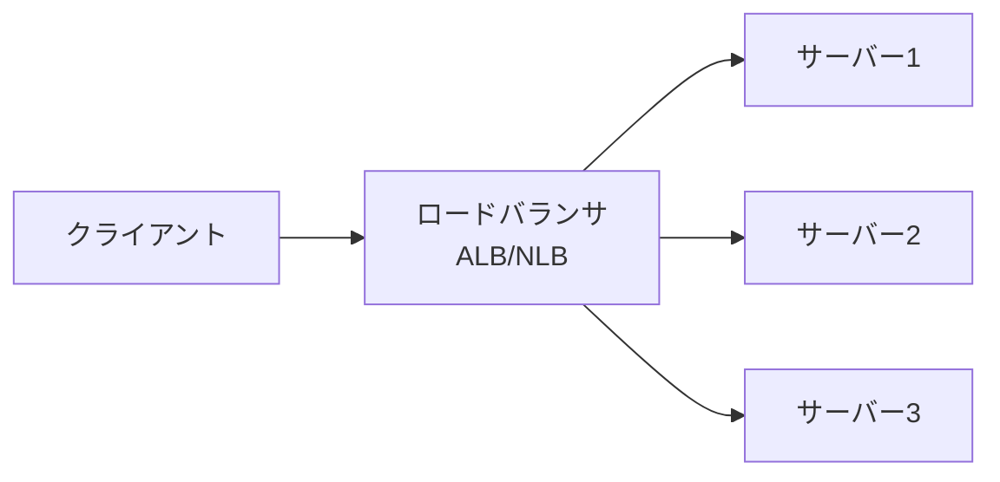

なぜサーバーが1台ではダメなのか？
- **負荷分散**: 利用者が多いから（1台だと処理が追いつかない）
- **耐障害性**: 1台が壊れてもサービスが止まらないように
- **メンテナンス性**: 1台ずつ順番にアップデートできる

| 種類 | OSI層 | 分散の判断基準 | AWSでの名前 |
|------|------|--------------|------------|
| L4ロードバランサ | トランスポート層 | IPアドレスとポート番号 | NLB (Network LB) |
| L7ロードバランサ | アプリケーション層 | URLパスやHTTPヘッダー | ALB (Application LB) |

### FW / SG (ファイアウォール / セキュリティグループ)

どちらもFireWallのこと。AWSではSecurityGroupと呼ぶ。

ファイアウォールとは、ネットワークの通信を制御する「門番」のようなもの。許可されたポートや通信元からの通信だけを通し、それ以外はブロックする。


設定例（考え方）:
- 「Webサーバーには誰でもHTTPS (443) でアクセスできる」
- 「SSHは社内のIPアドレスからのみ許可」
- 「データベースのポート (3306) はWebサーバーからのみ許可」

### Proxy (プロキシ)

通信を中継するサーバー。大きく2種類ある。

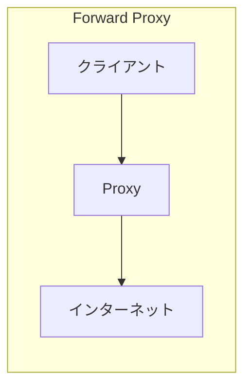

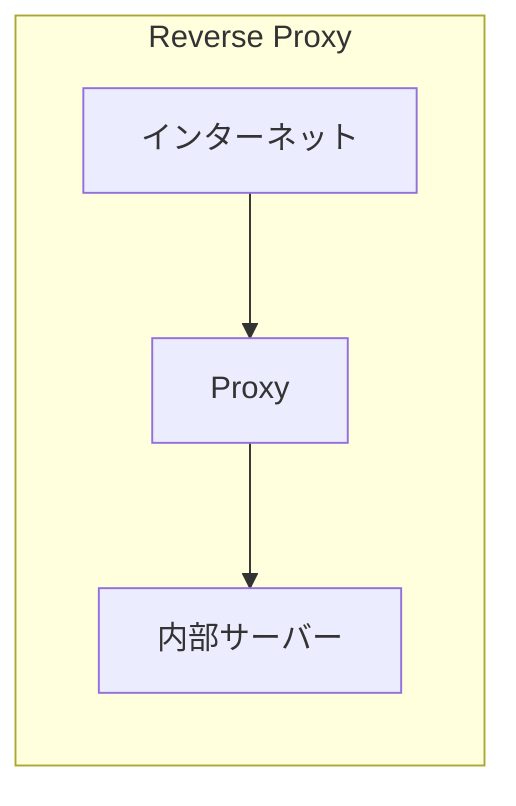

| 種類 | 方向 | 用途 |
|------|------|------|
| Forward Proxy | 内部→外部 | 社内からインターネットへ出るときに経由。ログ記録・アクセス制御 |
| Reverse Proxy | 外部→内部 | 外部からのアクセスを受けて内部サーバーに振り分け。SSL終端・キャッシュ |

#### Forward Proxy の設定

企業ネットワークではインターネットに出るためにProxy設定が必要なことが多い:

```bash
# Linux
export http_proxy=http://proxy-server:3128
export https_proxy=http://proxy-server:3128
export no_proxy=localhost,127.0.0.1,.internal.example.com
```

> `no_proxy` で指定した宛先にはProxyを経由しない（同一ネットワーク内の通信など）。

## XaaS (IaaS / PaaS / SaaS)

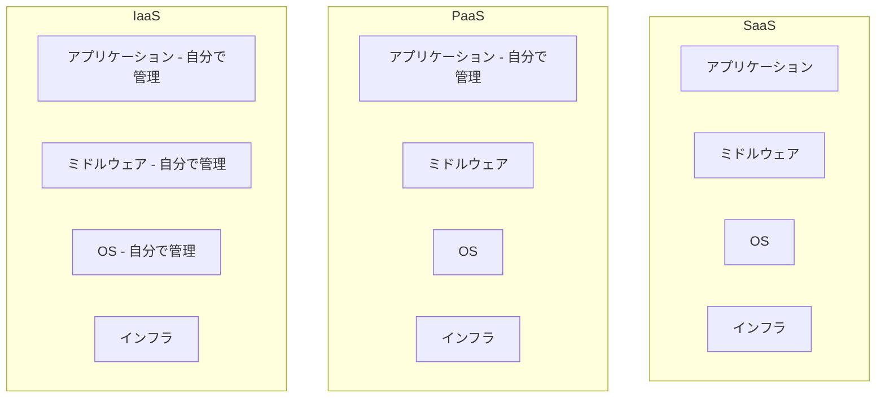

| サービス | 読み方 | 提供されるもの | 自由度 |
|---------|--------|---------------|--------|
| IaaS | イアース | インフラ（仮想サーバー、ネットワーク） | 高い/難しい |
| PaaS | パース | プラットフォーム（開発環境） | 中程度 |
| SaaS | サース | ソフトウェア（完成品） | 低い/簡単 |

### 具体例

- **SaaS**: Gmail, Slack, Salesforce, Zoom
- **PaaS**: Google App Engine, AWS Elastic Beanstalk
- **IaaS**: Amazon EC2, Google Compute Engine

### WordPressで理解するXaaS（家づくりのたとえ）

| サービス | 家づくりの例え | WordPress環境での利用形態 |
|---------|--------------|------------------------|
| IaaS | 🌳 更地（土地）を借りる | AWS EC2にOS/Apache/PHP/MySQLを自分で入れてWordPressを構築 |
| PaaS | 🔨 プレハブの家を借りる | Xserver, ConoHa WING などのマネージドホスティング |
| SaaS | 🛋️ 家具付きマンションを借りる | WordPress.com（すぐ使える。カスタマイズ制限あり） |

IaaSは自由度が高いが全部自分でやる必要がある。SaaSは簡単だがカスタマイズが制限される。

## インフラの基本要素

### OSS (Open Source Software)

- 無料で誰でも使うことができる
- ソースコード（プログラムの中身）が公開されているので、誰でも読める・改良できる
- そのかわり、聞く宛てが無い（自分で調べてどうにかする）
- 商用ソフトにはサポート窓口があるが、OSSはコミュニティ（掲示板やGitHub）で自力で解決する

> **OSSの例**: Linux, Apache, nginx, MySQL/MariaDB, Python, Git, Docker, Kubernetes, Ansible, Terraform...

### プラットフォーム

```mermaid
graph TB
    subgraph "オンプレミス"
        DC[データセンター] --> HW1[物理サーバー]
        DC --> HW2[物理サーバー]
    end
    subgraph "クラウド"
        Internet[インターネット] --> AWS[AWS]
        Internet --> GCP[GCP]
    end
    Engineer[エンジニア] --> |車で移動| DC
    Engineer --> |ブラウザで操作| Internet
```

#### オンプレミス（オンプレ）

- データセンターを借りて、そこにハードウェアを設置してサービスする
- 物理的に社屋に到達できる

#### クラウド

- インターネット上にある、データセンタを借りるイメージ
- ブラウザで、ポチポチやれば、OSが構築できる
- **AWS** (Amazon Web Service)
- **GCP** (Google Cloud Platform)
- その他: Azure, Oracle Cloud, 国産(fujitsu, sakura, IDCF)

#### 仮想マシン環境

- Windows: WSL
- Linux: vmware, vcenter, proxmox(OSS)
- AWS/GCP: EC2

### IaC (Infrastructure as Code)

- IaC が無い世界: 人間がコマンドとか命令を逐次出して設定する
- IaC: プログラムのようなもので一括で設定する

::: tip IaCのメリット
- **再現性**: 同じコードを実行すれば、同じ環境ができる
- **バージョン管理**: Gitで変更履歴を追える（いつ誰が何を変えたか）
- **レビュー可能**: コードなので、他の人がチェックできる
- **大量展開**: 100台のサーバーでも1回のコマンドで同じ設定ができる
:::

代表的なIaCツール:
| ツール | 用途 |
|--------|------|
| Ansible | サーバーの構成管理（OSの設定、パッケージ導入など） |
| Terraform | クラウドリソースの作成・管理（EC2、VPCなど） |
| CloudFormation | AWS専用のIaCツール |

### CI/CD

継続的インテグレーション/継続的デリバリー。全自動でやります。

```mermaid
graph LR
    Code[コード変更] --> CI[CI<br/>ビルド/テスト]
    CI --> CD[CD<br/>デプロイ]
    CD --> Prod[本番環境]
```

| 用語 | 意味 | やること |
|------|------|---------|
| CI (Continuous Integration) | 継続的インテグレーション | コードを変更したら自動でビルド＆テストが走る |
| CD (Continuous Delivery) | 継続的デリバリー | テストに通ったら自動で本番環境にデプロイされる |

> **なぜ必要？** 手動だとミスが起きる。ノード数が多い環境を毎回手動で更新するのは現実的ではない。CIで品質を担保し、CDで安全にリリースする。

### スケールアップとスケールアウト

両方とも目的としては出力を上げること。

```mermaid
graph LR
    subgraph "スケールアップ（垂直）"
        A1[サーバー] -->|パワーアップ| A2[強いサーバー]
    end
    subgraph "スケールアウト（水平）"
        B1[サーバー1]
        B2[サーバー2]
        B3[サーバー3]
    end
```

| 種類 | 説明 | 別名 |
|------|------|------|
| スケールアップ | パワーアップ（CPUやメモリを増強） | 垂直スケール |
| スケールアウト | 仲間を増やす（サーバー台数を増やす） | 水平スケール |

## 接続ツール

### SSH (Secure SHell)

- LinuxというOSにリモート接続するための手段
- コマンドベース（CUI）
- SSHクライアント: WSL (Windows Subsystem for Linux) を使うのが良い

```bash
# 基本的な接続方法
ssh ユーザ名@接続先IPアドレス

# 例
ssh ubuntu@192.168.1.100

# 鍵認証で接続（パスワードの代わりに鍵ファイルを使う）
ssh -i ~/.ssh/my_key.pem ubuntu@192.168.1.100
```

::: tip SSH鍵認証とは
パスワードの代わりに「秘密鍵」と「公開鍵」のペアで認証する仕組み。
- **公開鍵**: 接続先サーバーに置く（鍵穴にあたる）
- **秘密鍵**: 自分のPCに持っておく（鍵にあたる）

パスワードよりも安全で、自動化にも向いている。
:::

#### SSHキーペアの作成

```bash
# 一般ユーザで実行
ssh-keygen

# 対話的に以下を聞かれる:
# 1. ファイル保存場所（デフォルト: ~/.ssh/id_rsa）
# 2. パスフレーズ（キーペアに付与するパスワード。空Enterでなしも可）
# 3. パスフレーズの確認
```

生成されるファイル:
| ファイル | 種類 | 扱い |
|---------|------|------|
| `~/.ssh/id_rsa` | 秘密鍵 (プライベートキー) | 自分だけの秘密。外部に漏らさない |
| `~/.ssh/id_rsa.pub` | 公開鍵 (パブリックキー) | SSH接続したいサーバーやGitHubに置く |

#### ~/.ssh/config の活用

SSH接続を便利にする設定ファイル。毎回長いコマンドを打たなくてよくなる。

```bash
# ~/.ssh/config に以下を記載
Host my-server
  User ubuntu
  HostName 192.168.1.100
  IdentityFile ~/.ssh/my_key.pem
```

設定すると:

```bash
# before: 毎回これを打っていた
ssh -i ~/.ssh/my_key.pem ubuntu@192.168.1.100

# after: これだけでよい
ssh my-server
```

メリット:
- `Tab` キーでホスト名を補完できる（これだけで価値がある）
- プロキシ経由の設定も書ける
- ユーザ名・鍵の指定を自動化できる

### WSL (Windows Subsystem for Linux)

WindowsのPC上でLinuxを動かす仕組み。これを使えば、Windowsから離れることなくLinuxのコマンドやSSH接続ができる。

```powershell
# WSLのインストール（PowerShellで実行）
wsl --install
```

### RDP (リモートデスクトップ)

- WindowsというOSにリモート接続
- GUI（マウスでポチポチ）
- Windowsに標準搭載されている「リモートデスクトップ接続」アプリを使う
- 接続先のIPアドレスとユーザ名/パスワードが必要

## IDE とエディタ

### IDE (Integrated Development Environment)

エディタの凄い版。様々なプログラミングの支援をする:

- 補完: 途中まで入力したらいい感じに書いてくれる
- デバッガー: バグを検知して教えてくれる
- フォーマッター: 段落・字下げなどを統一
- リンター: 世間一般的な作法を適用

#### 具体的なツール

- **VSCode**: マイクロソフト製、無料
- **Eclipse**: OSS、無料 (Java)
- **IntelliJ**: JetBrains社、有償
- **Cursor**: AI支援特化、有料

### エディタ

文書を新規作成、編集するもの。

#### Vim

- Linux の標準的なメモ帳
- 止め方: `:q`（変更を保存せず終了）、`:wq`（保存して終了）、`:q!`（強制終了）

**2つのモード:**

| モード | 説明 | 切替方法 |
|--------|------|----------|
| ノーマルモード | カーソル移動、コピペ、検索、保存 | ESC または Ctrl+[ |
| 挿入モード | 文字を書く | i, o, O, a, A |

**ノーマルモードでよく使うキー:**

| キー | 動作 |
|------|------|
| `h` `j` `k` `l` | 左・下・上・右に移動（矢印キーでも可） |
| `dd` | 1行削除（カット） |
| `yy` | 1行コピー（ヤンク） |
| `p` | 貼り付け（ペースト） |
| `u` | 元に戻す（undo） |
| `/検索語` | 文字列を検索 |
| `:w` | 保存 |
| `:wq` | 保存して終了 |
| `:q!` | 保存せずに強制終了 |
| `gg` | ファイルの先頭に移動 |
| `G` | ファイルの末尾に移動 |

```bash
vim hoge.txt    # ファイルを開く（なければ新規作成）
vimtutor ja     # チュートリアル（まずこれをやるべし）
```

::: warning 初心者あるある
vimを起動して文字が打てない！ → `i` を押して挿入モードに入る。
vimを終了できない！ → `ESC` を押してから `:q!` で強制終了。
:::

### VSCode

- Windows, Linux, Macで動く万能で無料なエディタ
- プラグインが豊富で何でも開発できる
- DL: https://code.visualstudio.com/

#### インストール

パッケージマネージャ推奨:
- Windows: `winget`
- Linux: `apt` (msのリポジトリ追加が必要)
- Mac: `homebrew`

#### おすすめプラグイン

- Japanese Language Pack
- Error Lens
- VSCode Icons
- IntelliCode
- Remote Development

#### SSH リモート開発

VSCodeを使ってサーバー環境にSSHリモート接続可能。

#### プロキシ経由での拡張機能インストール

プロキシ環境下では、VSCodeの接続先ホストにプロキシ設定が必要:

```bash
cat << 'EOT' >> ~/.bashrc
export HTTP_PROXY=http://your-proxy-server:3128
export HTTPS_PROXY=http://your-proxy-server:3128
EOT
```

## Linux 基本コマンド

インフラエンジニアが日常的に使うのは Linux OS（仮想環境が多い）と Terminal（黒い画面。シェルともいう）。

### よく使う最初のコマンド

```bash
pwd          # 今いる場所（カレントディレクトリ）を表示
cd hoge/fuga # ディレクトリ移動
cd           # 引数なしでホームディレクトリに戻る
```

#### ファイル一覧: ls -ltr

```bash
ls -ltr
```

| オプション | 意味 |
|-----------|------|
| `-l` | 詳細表示 |
| `-t` | 最終更新日時順（降順） |
| `-r` | ソート順を逆にする |

::: tip なぜ `ll` ではなく `ls -ltr` か
- `ll` はエイリアスであり、Unix系OS（Solaris等）ではデフォルトで存在しない場合がある
- `-ltr` にすると**最近更新されたファイルが一番下**に来る
- つまり「一番下 = 最近更新があったファイル」。障害時にログを探すとき便利
:::

### システム情報の確認

```bash
# OS（ディストリビューション）の種類 — 最もOS依存しない方法
cat /etc/issue

# カーネルのバージョン
uname -r

# CPUのアーキテクチャ
uname -m
# x86_64  → Intel/AMD 64bit（現在の主流）
# i686    → 32bit x86（古い環境）
# aarch64 → ARM 64bit（ラズパイ、Apple M1等）

# CPUの種類とコア数
cat /proc/cpuinfo

# ディスクの空き容量（ファイルシステムの種類付き）
df -Th
# -T: ファイルシステムのタイプ表示  -h: 人間が読みやすい単位

# 特定ディレクトリの利用量
du -sh ディレクトリ名
# -s: サマリ表示（サブディレクトリを個別表示しない）

# メモリの状況（+ swap）
free -h

# マシンが忙しいかどうか
top
# top 起動中に「1」を入力 → CPUコア別の利用率が見える
```

### ユーザ・グループの確認

```bash
$ id
uid=1000(testuser) gid=1000(testuser) groups=1000(testuser),4(adm),27(sudo)
```

| 項目 | 意味 |
|------|------|
| `uid` | ユーザーID（ユーザーを識別するシステム内部の番号） |
| `gid` | プライマリグループID |
| `groups` | 所属している全グループ |

### ヒアドキュメント

標準入力を使って複数行をファイルに書き込む方法。設定ファイルを作るときに便利。

```bash
# 上書き（既存の内容は消える）
cat > fukusugyo.txt << 'EOF'
1行目の内容
2行目の内容
EOF

# 追記（既存の内容の後ろに追加）
cat >> fukusugyo.txt << 'EOF'
追加する内容
EOF
```

::: warning 注意
`>` が1個だと**上書き**、`>>` だと**追記**。上書きすると元の内容が消えるので注意！
:::

## パーミッション（ファイル権限）

### ファイルの見方

```bash
ls -l
# drwxr-xr-x  17 testuser testuser   4096 May  1 16:15 myproject
# -rw-r--r--   1 testuser testuser     54 May 16 11:27 helloworld.py
```

#### パーミッション文字列の読み方

```
d rwx r-x r-x
│  │   │   └── その他ユーザーの権限
│  │   └────── グループの権限
│  └────────── 所有者の権限
└───────────── ファイルタイプ (d=ディレクトリ, -=通常ファイル)
```

| 文字 | 意味 | 数値 |
|------|------|------|
| `r` | 読み取り (read) | 4 |
| `w` | 書き込み (write) | 2 |
| `x` | 実行 (execute) | 1 |
| `-` | 権限なし | 0 |

#### 数値表現

各桁を足し算する:
- `rwx` = 4+2+1 = **7**
- `r-x` = 4+0+1 = **5**
- `r--` = 4+0+0 = **4**

よく見るパターン:
| 数値 | 文字 | 用途 |
|------|------|------|
| `755` | `rwxr-xr-x` | 実行ファイル、ディレクトリ |
| `644` | `rw-r--r--` | 一般的なファイル |
| `600` | `rw-------` | 秘密鍵など機密ファイル |
| `777` | `rwxrwxrwx` | 全員全権限（基本使わない。セキュリティリスク） |

### chmod: 権限の変更

```bash
# 数値指定（絶対値）
chmod 755 script.sh      # rwxr-xr-x
chmod 644 config.txt     # rw-r--r--

# 記号指定（相対値）
chmod g+r hoge           # グループに読み取り権限を追加
chmod o-w hoge           # その他ユーザーから書き込み権限を削除
chmod u+x script.sh      # 所有者に実行権限を追加
```

| 対象 | 意味 |
|------|------|
| `u` | 所有者 (user) |
| `g` | グループ (group) |
| `o` | その他 (other) |
| `a` | 全員 (all) |

`+` で追加、`-` で削除。

### chown: 所有者・グループの変更

```bash
# 所有者を変更
sudo chown newuser file.txt

# グループを変更
sudo chown :newgroup file.txt

# 所有者とグループを同時に変更
sudo chown newuser:newgroup file.txt

# ディレクトリ以下を再帰的に変更
sudo chown -R newuser:newgroup /path/to/dir
```

::: warning 注意
一般ユーザーは他人のファイルの所有者を変更できない（root/sudo が必要）。これはセキュリティ上の理由。自分のファイルの所有者を他人に変更されると、そのファイルを削除・変更されてしまうため。
:::

### ファイルシステムへの書き込みテスト

「書き込めるかどうか」を確認するシンプルな方法:

```bash
touch hoge.txt    # 空ファイルを作成してみる
# 成功すればファイルシステムは書き込み可能
# "Read-only file system" エラーが出れば書き込み不可
```

## sudo: 管理者権限の実行

### sudo が使える条件

`/etc/sudoers` ファイルの設定による。

```bash
# 自分がどのコマンドをsudoで実行できるか確認
sudo -l
```

#### /etc/sudoers の書式

```
user(または %group)  host=(runas_users:runas_groups)  commands
```

#### 設定例

```bash
# rootは全て実行可能
root    ALL=(ALL:ALL) ALL

# sudoグループのメンバーは全コマンド実行可能
%sudo   ALL=(ALL:ALL) ALL

# user1にパスワードなしで全コマンドを許可
user1   ALL=(ALL) NOPASSWD: ALL

# user1にApacheの再起動だけを許可
user1 ALL=(root) NOPASSWD: /usr/sbin/service apache2 restart

# user2にログの閲覧だけを許可
user2 ALL=(root) NOPASSWD: /usr/bin/tail /var/log/*
```

## サービス・プロセス管理

### netstat: ネットワーク接続の確認

サーバーで「どのポートが開いているか」「誰が接続しているか」を確認する。

```bash
# 基本: リッスンしているTCPポートを表示
netstat -ltpn

# UDP も含める
netstat -ltupn

# 確立済み接続も含めて全て表示
netstat -ltupna
```

| オプション | 意味 |
|-----------|------|
| `-l` | LISTEN状態のソケットのみ |
| `-t` | TCPのみ |
| `-u` | UDPも表示 |
| `-p` | PID/プログラム名を表示 |
| `-n` | ホスト名・ポート名を数値で表示 |
| `-a` | 全ての接続を表示（ESTABLISHEDなども） |

::: warning 一般ユーザ vs root
一般ユーザで実行すると、自分が起動したプロセスしかPID/Program nameが見えない。全プロセスを見るには `sudo` が必要。
:::

#### 出力の読み方

```
Proto Recv-Q Send-Q Local Address       Foreign Address     State       PID/Program name
tcp        0      0 0.0.0.0:80          0.0.0.0:*           LISTEN      1365/apache2
tcp        0      0 127.0.0.1:3306      0.0.0.0:*           LISTEN      1546/mysqld
tcp        0      0 0.0.0.0:22          0.0.0.0:*           LISTEN      1023/sshd
```

| 項目 | 意味 |
|------|------|
| `Proto` | プロトコル (tcp/udp) |
| `Recv-Q` | 受信キュー（通常0。非ゼロが続くとアプリに問題あり） |
| `Send-Q` | 送信キュー（通常0。非ゼロが続くと送信側に遅延あり） |
| `Local Address` | 待ち受けアドレス:ポート |
| `Foreign Address` | 接続元（LISTEN時は `*`） |
| `State` | ソケットの状態 |
| `PID/Program name` | プロセスIDとプログラム名 |

#### Local Address の読み方

| 表示 | 意味 |
|------|------|
| `0.0.0.0:80` | 全インターフェースのport 80で待ち受け（外部からアクセス可能） |
| `127.0.0.1:3306` | ローカルホストのみ。外部からはアクセス不可 |
| `:::80` | IPv6の全インターフェース |

#### State の種類

| State | 意味 |
|-------|------|
| `LISTEN` | 接続を待っている |
| `ESTABLISHED` | 通信中（3ウェイハンドシェイク完了） |
| `SYN_SENT` | 接続要求送信中 |
| `CLOSE_WAIT` | クローズ待ち |
| `TIME_WAIT` | 接続終了後の待機 |

### lsof: ファイル/ポートを使っているプロセスの特定

「このファイル/ポートを使っているのは誰？」を調べる。

```bash
# 特定のファイルを開いているプロセスを表示
sudo lsof /var/log/apache2/access.log

# 特定のポートを使っているプロセスを表示
sudo lsof -i :80
# COMMAND     PID     USER   FD   TYPE   DEVICE SIZE/OFF NODE NAME
# apache2  316077 www-data    4u  IPv6 52882782      0t0  TCP *:http (LISTEN)

# 特定プロセスが開いている全ファイル
sudo lsof -p PID
```

> `sudo` をつけないと一般ユーザが確認できる範囲は限られる。

### ps: プロセスの確認

#### ps auxw — リソース使用率を確認

```bash
ps auxww    # ww で長いコマンドも切れない
```

| カラム | 意味 |
|--------|------|
| `USER` | プロセスの所有者 |
| `PID` | プロセスID |
| `%CPU` | CPU使用率 |
| `%MEM` | メモリ使用率 |
| `VSZ` | 仮想メモリサイズ |
| `RSS` | 実メモリ使用量 |
| `STAT` | プロセスの状態 |
| `START` | 開始時刻 |
| `TIME` | CPU使用時間累計 |
| `COMMAND` | 実行コマンド |

#### ps -ef — 親子関係を確認

```bash
ps -ef
```

| カラム | 意味 |
|--------|------|
| `UID` | 所有者 |
| `PID` | プロセスID |
| `PPID` | **親プロセスID** |
| `C` | CPU使用率 |
| `STIME` | 開始時刻 |
| `CMD` | 実行コマンド |

#### pstree: プロセスのツリー表示

```bash
# インストール
apt install psmisc

# 特定PIDの子プロセスをツリー表示
pstree -p 3449791
# apache2(3449791)─┬─apache2(316077)─┬─{apache2}(316080)
#                  │                 ├─{apache2}(316082)
```

## ネットワーク調査コマンド

### 自ホストのネットワーク設定を確認

```bash
# IPアドレスの確認（Windowsの ipconfig に相当）
ip a
# 出力から inet の行を見る:
#   inet 192.168.1.xxx/24 ← ローカルIP と サブネットマスク

# ゲートウェイ（ルーティングテーブル）の確認
ip r
# または
route -n    # -n: 名前解決をしない（高速）
```

`route -n` の出力例と読み方:

```
Destination     Gateway         Genmask         Flags Iface
0.0.0.0         172.24.192.1    0.0.0.0         UG    eth0    ← デフォルトルート
10.10.10.0      192.168.1.1     255.255.255.0   UG    eth1    ← 特定NW用ルート
172.24.192.0    0.0.0.0         255.255.240.0   U     eth0    ← ローカルサブネット
```

- **デフォルトルート** (0.0.0.0): 宛先不明のトラフィックは全てこのGWを経由
- **ゲートウェイが 0.0.0.0**: GWを経由せず直接通信（同一セグメント内）

#### ipcalc: セグメントの確認

```bash
apt install ipcalc
ipcalc 192.168.100.14/24
ipcalc 192.168.100.14 255.255.255.240
```

ネットマスクによって分割されたネットワークの通信可能範囲（セグメント）をすぐに確認できる。

#### グローバルIPの確認

```bash
# 自分の端末が外に出ていくときのグローバルIP
curl ipconfig.io
curl ifconfig.io
```

### ping: 疎通確認

```bash
ping example.com
# PING example.com (93.184.216.34) 56(84) bytes of data.
# 64 bytes from ...: icmp_seq=1 ttl=236 time=14.6 ms
```

| 項目 | 意味 |
|------|------|
| `time` | 往復時間（RTT）。1ms = 0.001秒 |
| `ttl` | Time To Live。L3機器を1つ経由するごとに1減る。0で破棄（ループ防止） |

::: warning ping が返ってこない ≠ 疎通不可
ファイアウォールがICMPをブロックしていることは普通にある。pingが通らなくてもTCPは通る場合がある。疎通確認は `nc` や `curl` も併用すること。
:::

#### TTLの基礎値

| OS/機器 | TTL基礎値 |
|---------|----------|
| Linux / Unix | 64 |
| Windows | 128 |
| ネットワーク機器 | 255 |

> 例: ttl=102 → 128 - 102 = 26 → Windowsサーバーまで26台のL3機器を経由

### netcat (nc): ポートの疎通確認

```bash
# インストール（openbsd版推奨）
apt install netcat-openbsd

# クライアント: 特定ポートへの疎通確認
nc -vz ドメインまたはIP port

# 例: TCP 20〜100番ポートをスキャン
nc -vz 192.168.1.100 20-100
# Connection to 192.168.1.100 22 port [tcp/ssh] succeeded!
# Connection to 192.168.1.100 80 port [tcp/http] succeeded!
```

| オプション | 意味 |
|-----------|------|
| `-v` | 詳細表示 |
| `-z` | データを送らずに接続確認だけ行う |
| `-l` | サーバーモード（Listen） |
| `-k` | 接続終了後も待ち受けを継続 |

```bash
# サーバー: 簡易的に好きなポートでサーバーを起動（デバッグ用）
nc -lk 8000

# HTTP レスポンスも見たいなら python モジュールで
python3 -m http.server 8080
```

> 特権ポート (0-1023) はroot権限がないとListenできない。

### curl: HTTP通信の調査

HTTPリクエストを送信し、レスポンスを確認するコマンド。

```bash
# 基本: GETリクエスト
curl http://127.0.0.1:8000

# 詳細なデバッグ出力（リクエスト/レスポンスヘッダも表示）
curl -v http://127.0.0.1:8000

# レスポンスヘッダのみ取得
curl -I http://127.0.0.1:8000

# リダイレクト(3xx)を自動フォロー
curl -L http://example.com

# プロキシ経由
curl -x http://proxyserver:port http://example.com

# SSL証明書エラーを無視（自己署名証明書等）
curl -k https://self-signed.badssl.com/

# ステータスコードだけ取得
curl -o /dev/null -s -w "%{http_code}\n" http://127.0.0.1:8080
```

#### よく使うオプション

| オプション | 意味 |
|-----------|------|
| `-v` | 詳細出力（デバッグ） |
| `-I` | HEADリクエスト（ヘッダのみ） |
| `-L` | リダイレクトをフォロー |
| `-x` | プロキシ指定 |
| `-k` | SSL検証を無視 |
| `-H` | カスタムヘッダ追加 |
| `-X` | HTTPメソッド指定 |
| `-d` | POSTデータ送信 |
| `-u user:pass` | ベーシック認証 |
| `-A` | User-Agent指定 |
| `-b` | Cookie送信 |
| `-s` | サイレントモード |
| `-w` | カスタムフォーマット出力 |

#### POST リクエスト

```bash
# フォームデータ
curl -X POST -d "param1=value1&param2=value2" http://127.0.0.1:8000

# JSON データ
curl -X POST -H "Content-Type: application/json" \
  -d '{"key1":"value1", "key2":"value2"}' http://127.0.0.1:8000

# 認証ヘッダ付き
curl -H "Authorization: Bearer YOUR_ACCESS_TOKEN" http://127.0.0.1:8000
```

#### -w で使える変数

| 変数 | 意味 |
|------|------|
| `%{http_code}` | HTTPステータスコード |
| `%{time_total}` | 全体のリクエスト時間（秒） |
| `%{time_namelookup}` | 名前解決にかかった時間 |
| `%{time_connect}` | 接続確立までの時間 |
| `%{time_starttransfer}` | 最初のバイトが転送された時間 |
| `%{size_download}` | ダウンロードされたバイト数 |

## ファイル転送

### プロトコルとは

お互いにやりとりするための共通の言葉（ルール/規約）のこと。

> **たとえ話**: 日本人同士は日本語で会話する。英語圏の人とは英語で会話する。「何語で喋るか」がプロトコルにあたる。コンピュータも通信相手と同じプロトコルを使わないと通じない。

代表的なプロトコルとポート:

| プロトコル | ポート | 何をする？ |
|-----------|--------|-----------|
| HTTP | 80 | Webページを表示する（暗号化なし） |
| HTTPS | 443 | Webページを表示する（暗号化あり） |
| SSH | 22 | リモートで安全にサーバーに接続する |
| FTP | 21 | ファイルを送受信する |
| DNS | 53 | ドメイン名をIPアドレスに変換する |
| SMTP | 25 | メールを送信する |

### ファイル転送プロトコル

| プロトコル | port | 特徴 |
|-----------|------|------|
| ftp | 21 | 古い。暗号化されていない。絶滅寸前 |
| sftp | 22 | 暗号化されている。主流 |
| rsync | - | 同期（sync）ができる。暗号化の有無を選択可能 |
| ftps | 989,990 | ほぼ使っている人はいない |

rsync の同期イメージ:

```mermaid
graph LR
    subgraph "サーバーA"
        A1[ファイル1]
        A2[ファイル2]
        A3[ファイル3 ★新規]
    end
    subgraph "サーバーB"
        B1[ファイル1]
        B2[ファイル2]
        B3[ファイル3 - 同期]
    end
    A3 -->|rsync| B3
```

### sftp の使い方

```bash
sftp ubuntu@192.168.1.100
```

- `!` をつけると接続元、つけないと接続先を参照
- `mput ファイル名`: ファイルを送る
- `mget ファイル名`: ファイルを取得する

### GUIソフトウェア

- **WinSCP**: ftp, sftp, ftps どれでも利用可能
- **FFFTP**: ftp, sftp, ftps どれでも利用可能

## ログの見方

### 便利なコマンド

#### less: ファイルの閲覧

```bash
less /var/log/syslog
less -S /var/log/syslog    # -S: 長い行を改行しない
less -N /var/log/syslog    # -N: 行番号を表示
```

#### tail: ファイル末尾の表示

```bash
tail filename       # デフォルトで最後の10行を表示
tail -f filename    # リアルタイムでファイルの更新を表示（ログ監視に必須）
tail -n 50 filename # 最後の50行を表示
```

#### grep: パターン検索

```bash
grep 'error' /var/log/syslog           # errorを含む行を表示
grep -i 'error' /var/log/syslog        # 大文字小文字を区別しない
grep -r 'pattern' /path/to/dir         # サブディレクトリも含めて再帰検索
grep -c 'error' /var/log/syslog        # マッチした行数を表示
grep -v 'debug' /var/log/syslog        # debugを含まない行を表示
```

#### awk: テキスト処理

フィールド（列）を指定して抽出・加工するコマンド。ログ解析に強い。

```bash
# 特定フィールドを抽出（apacheアクセスログからIPとステータスコード）
awk '{print $1, $9}' access.log
# 172.24.192.1 200
# 172.24.192.1 404

# 条件でフィルタリング（ステータスコード200の行のみ）
awk '$9 == 200 {print $0}' access.log

# 合計を算出（レスポンスサイズの合計）
awk '{sum += $10} END {print sum}' access.log

# 区切り文字を変更（CSV処理）
awk -F',' '{print $2}' data.csv
# -F: フィールド区切り文字（デフォルトはスペース/タブ）
```

### 便利なシェル操作（ターミナルショートカットキー）

ターミナルのショートカットキーはデフォルトで **emacs のキーバインド**と同じ。覚えればemacsでもそのまま使える。

#### カーソル移動

| キー | 動作 | 備考 |
|------|------|------|
| `Ctrl + b` | ←（左に1文字移動） | 矢印キー←と同じ |
| `Ctrl + f` | →（右に1文字移動） | 矢印キー→と同じ |
| `Ctrl + a` | 行頭に移動 | 長いコマンドの先頭に戻る |
| `Ctrl + e` | 行末に移動 | 行頭で修正後に行末に戻る |
| `Ctrl + p` | 一つ前の履歴 | 矢印キー↑と同じ |
| `Ctrl + n` | 一つ後の履歴 | 矢印キー↓と同じ |

#### 文字列削除

| キー | 動作 | 備考 |
|------|------|------|
| `Ctrl + d` | カーソル位置の文字を削除 | Deleteキーと同じ。空行で押すとログアウト |
| `Ctrl + h` | カーソルの1文字前を削除 | Backspaceと同じ |
| `Ctrl + u` | 行頭まで削除 | カーソルから左を全削除 |
| `Ctrl + k` | 行末まで削除 | カーソルから右を全削除 |
| `Ctrl + w` | 単語単位で左を削除 | スペース区切りで1単語消す |
| `Ctrl + y` | 削除した文字列を貼り付け (yank) | Ctrl+k/u で消したものを戻す |

#### その他

| キー | 動作 | 備考 |
|------|------|------|
| `Ctrl + c` | 実行中のコマンドを中断 | 強制終了 |
| `Ctrl + r` | コマンド履歴を検索 | 文字入力で部分一致検索。Enter で実行、Esc で編集モード |
| `Ctrl + l` | 画面クリア | ターミナルをリセットして見やすくする |

::: tip Ctrl + d の多段ログアウト
ssh接続、mysql接続、docker exec 等、多段で接続しているものを終了するとき、`exit` を連打しなくても `Ctrl + d` で1段ずつ抜けられる。
:::

## プログラミング言語

### インフラエンジニアがよく使う言語

- **shell-script** (必須)
- **python**

#### ワンライナー

1行でやりたいことを手軽にプチ自動化すること。「一行野郎」とも呼ばれる。

```bash
# 例: "ほげほげ" を10回表示する
for i in $(seq 10); do echo "ほげほげ"; done

# 例: カレントディレクトリの.logファイルを全て削除
find . -name "*.log" -delete

# 例: あるファイルの中から "error" を含む行だけ表示
grep "error" /var/log/syslog
```

### インタプリタ vs コンパイラ

```mermaid
graph LR
    subgraph "インタプリタ"
        Src1[ソースコード] --> |1行ずつ翻訳&実行| Result1[結果]
    end
    subgraph "コンパイラ"
        Src2[ソースコード] --> |ビルド| Bin[バイナリ]
        Bin --> |実行| Result2[結果]
    end
```

| 方式 | 特徴 | 例 |
|------|------|------|
| インタプリタ | ビルド不要。逐次翻訳しながら実行。遅いがプログラミングしやすい | python, bash, php |
| コンパイラ | 先にビルドして機械語に翻訳。速度が速い | c, java |

### プログラミング言語の種類

| 言語 | 特徴 |
|------|------|
| C言語 | 難しい。apache, nginx, MariaDB等はこれで書かれている |
| HTML | ホームページ作成に特化 |
| Python | 何でもできる。HP、アプリ、ゲーム、バッチ |
| PHP | HP作成が得意、バッチ |
| Ruby | 日本人作者。優しいとされている |
| shell-script | shell操作に特化。インフラエンジニア向け |
| Java | 何でもできる |
| Go | 何でもできる |
| JavaScript | - |
| C# | ゲーム、web、スマホアプリなど何でも |

### 変数

```bash
a=b        # aという入れ物にbが入る
echo ${a}  # → b
```

**スコープ**: 変数がいつまで有効なのか？

| スコープ | 説明 | 設定例 |
|---------|------|--------|
| そのコマンド限り | 1回のコマンド実行中だけ有効 | `ENV=prod command` |
| シェルセッション限り | ユーザがログインしている間有効 | `export MY_VAR=hello` |
| 全ユーザ共通 | どのユーザでも参照できる | `/etc/environment` に記載 |
| 恒久的（個人） | ログインするたびに自動で設定される | `~/.bashrc` に記載 |

```bash
# シェルセッション限り（ターミナルを閉じたら消える）
export GREETING="hello"
echo $GREETING  # → hello

# 恒久的にしたい場合は ~/.bashrc に書く
echo 'export GREETING="hello"' >> ~/.bashrc
```

## AI・開発環境の整備

### 生成AI

#### 無料で使えるもの

- Gemini: https://gemini.google.com/app
- NotebookLM: https://notebooklm.google.com (RAG)

#### 有償AIツール

- **Claude** (Claude.ai, Claude code)
- **Cursor**: AI特化型IDE
- **Devin**: 自律型AI Agent
- **ChatGPT / Codex**
- **Perplexity**

### キーボード: Caps → Ctrl 入れ替え

```reg
Windows Registry Editor Version 5.00
[HKEY_LOCAL_MACHINE\SYSTEM\CurrentControlSet\Control\Keyboard Layout]
"Scancode Map"=hex:00,00,00,00,00,00,00,00,02,00,00,00,1d,00,3a,00,00,00,00,00
```

管理者権限のDOS窓から:

```cmd
reg import caps.reg
```

### 物理マシン

- 自宅で1万円程度のノートパソコンを買う（アマゾン整備品、メモリ8GB程度）
- Linuxをインストールする

## 読み方辞典

| 表記 | 読み方 |
|------|--------|
| vi | ぶいあい |
| vim | びむ |
| wget | ダブルゲット |
| ping | ぴん |
| etc | エトセ |
| opt | オプト |
| var | ばー |
| tmp | テンプ |
| src | ソース |
| bin | ビン |
| lib | リブ |
| dev | デブ |
| proc | プロック |
| conf | コンフ |
| apache2 | アパッチ2 |
| nginx | エンジンエックス |
| DB | デービー |
| MySQL | マイエスキューエル |
| sudo | スードゥー |
| chmod | チェンジモード (シーエイチモッド) |
| chown | チェンジオーナー (シーエイチオウン) |
| CIDR | サイダー |
| AWS | エーダブリューエス |
| GCP | ジーシーピー |
| IaaS | イアース |
| PaaS | パース |
| SaaS | サース |
| LDAP | エルダップ |
| FQDN | エフキューディーエヌ |

## 用語辞典

### WordPress

- CMS (Contents Management Systems): 簡単にホームページを作れるもの
- オープンソース

### FQDN (Fully Qualified Domain Name)

- 完全修飾ドメイン名。ホスト名 + ドメイン名の完全な形
- 例: `www.example.com` (短縮形だと `www` だけ)

### NAT (Network Address Translation)

- プライベートIPをグローバルIPに変換する仕組み
- 家庭のルーターや企業のファイアウォールが担う

### DHCP (Dynamic Host Configuration Protocol)

- IPアドレスを自動的に割り振る仕組み
- PCをネットワークに接続すると自動でIPが付与されるのはDHCPのおかげ

### デーモン (daemon)

- バックグラウンドで常時動いているプロセス
- サービス名の末尾に `d` がつくことが多い（sshd, httpd, mysqld 等）

