# 育成計画: その他・基礎

| 更新日 | バージョン | 更新者 | 更新内容 |
|--------|-----------|--------|----------|
| 2024年3月31日 | 初版 | Author A | 初版作成 |
| 2024年4月4日 | ver1.1 | Author B | ・こころ構えに「作業時に意識すること」を追加 ・「ネットワークとは」を追加 |

## 初期のうちに知っておくこと

### コンピュータの構成

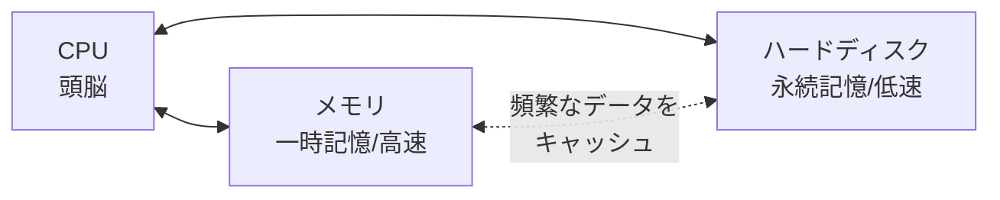

#### CPU

- 命令を計算処理するための頭脳
- かしこいほうが、そりゃ計算がはやい
- スーパーコンピューター: これが、えげつないやつ

#### メモリ (Memory)

- 8ギガバイトとかいうサイズ
- ハードディスクにくらべて、単純に価格が高い。が、爆速
- 一時的に記憶するもの
  - 毎回ハードディスクに、データを取りにいくと時間がかかるので、メモリが頻繁にアクセスするものを一時的に記憶してくれる
  - PCの電源を落とすとここで記憶したものは消える（**揮発性メモリ**という）
- 単純にデータを読み込む速度が爆速

::: tip 速度のイメージ
| 記憶媒体 | アクセス速度 | たとえ |
|---------|------------|--------|
| メモリ (RAM) | ナノ秒 (10⁻⁹秒) | 机の上の本を開く |
| SSD | マイクロ秒 (10⁻⁶秒) | 隣の部屋の本棚から取る |
| HDD | ミリ秒 (10⁻³秒) | 図書館まで歩いて取りに行く |

メモリはHDDの約10万倍速い。だからよく使うデータはメモリに置いておく。
:::

#### データの単位

1. **bit（ビット）** → 1byte は、8bit
2. **Byte（バイト）** ↓ 1024
3. **Kilobyte (KB)**
4. **Megabyte (MB)**
5. **Gigabyte (GB)**
6. **TeraByte (TB)**

「Bit」は、デジタルデータを扱う最小単位であり、「0」または「1」の二つの値を示す情報の形を表現します。

「Byte」は、「8 bits」を一つのまとまりとして表すために使用されます。一桁の数値や、アルファベット一文字を格納するのに十分な容量があります。

大まかな規模感:

- テキストファイル1つ（約1ページ）：約2KB
- 写真1枚（スマホで撮影）：約5MB
- 2時間の映画1本（HD画質）：約1GB以上

つまり、1GBの空き容量があれば、大体300枚の写真、あるいは1本のHD映画を保存できます。

1TB (テラバイト)は1024GBで、大量のデータを持つPCのハードディスクなどに用いられる単位です。

#### 記憶装置（ハードディスク）

- 250ギガバイトというサイズがある
- ファイルとかデータを書き込むと、記憶してくれる
- PCの電源を落としても、データは消えない

> **たとえ話**
>
> 本棚 = ハードディスク、机 = メモリ
>
> 脳味噌さんが、あの選手のデータがほしい → 机にある本をパッと開く → ここにない本は、わざわざ本棚に探して取りにいく

## インフラとは

- **社会インフラ** (インフラストラクチャー): 電気、水道、ガスなど、社会を支える公共設備
- **ITインフラ**: ITに特化した設備（パソコン、サーバ、ネットワーク機器、ストレージ、OS、LANなど）

参考: https://digital-shift.jp/flash_news/s_210201_11

## ITエンジニアの種類

めちゃめちゃ大雑把に分類すると…

- **プログラマー**: プログラムをつくる人
- **インフラエンジニア**: インフラを整備、管理する人

## ハードウェアとソフトウェア

### ハードウェア

物理的に存在する機械（サーバ、ネットワーク機器、マウス、プリンターなど）

### ソフトウェア = プログラム

重さがないもの。ハードウェア上で稼働する目に見えないもの（アプリケーション、ゲームなど）

## OS (Operating System)

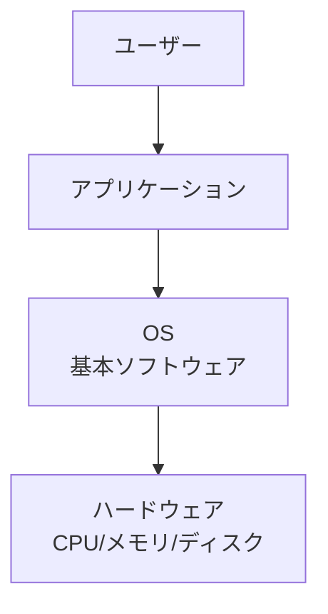

- **基本ソフトウェア**: ハードウェアとユーザやアプリケーションをつなぐ
- **アプリケーション**: OS上で稼働するシステム

### Windows と Unix

| 種類 | 特徴 |
|------|------|
| Windows / Mac | GUI（画面）で操作、見た目でわかりやすい、リソース食い |
| Unix系 | 長時間稼働するサーバやネットワーク機器によく使われる。CUI(CLI)が多い |

Unix の親戚に Linux（ubuntu/centosなど）がある。

### マウスの使い方

- ダブルクリック → 単語選択
- トリプルクリック → 1行選択

## パソコンとサーバーの違い

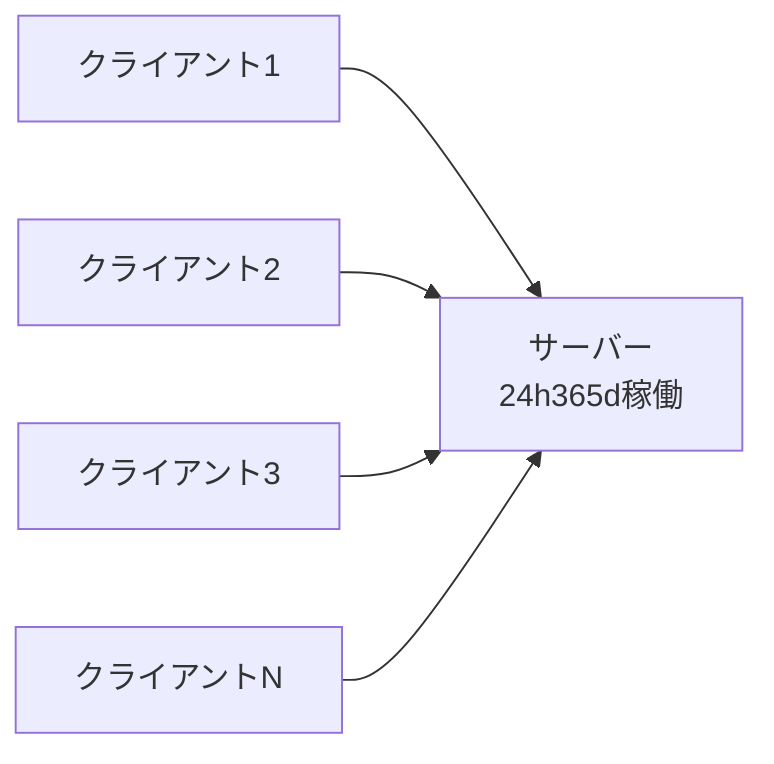

### サーバー

- サーバーを利用する人（提供を受ける人）のことを**クライアント**という
- 24時間365日電源を入れっぱなしにしても安定的に稼動し続ける
- 冗長化されている（電源など壊れやすい部位は2個づつある）
- 1台で10人〜数千人が利用する想定

> **たとえ話**: ビールサーバー = ビールという液体をサービス(提供)している。ビールジョッキ = 利用者

### パソコン

- 基本的には使いたいときに電源を入れる
- 一人、1台

## ExampleCorpのインフラの道具について

### サーバOS

- Linux 9.5割
- Windows Server 0.5割

### OSS (Open Source Software)

- 無料で誰でも使うことができる
- ソースコード（プログラムの中身）が公開されているので、誰でも読める・改良できる
- そのかわり、聞く宛てが無い（自分で調べてどうにかする）
- 商用ソフトにはサポート窓口があるが、OSSはコミュニティ（掲示板やGitHub）で自力で解決する

> **OSSの例**: Linux, Apache, nginx, MySQL/MariaDB, Python, Git, Docker, Kubernetes, Ansible, Terraform...

### プラットフォーム

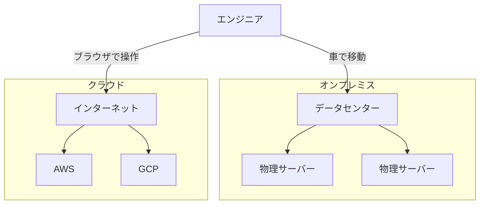

#### オンプレミス（オンプレ）

- データセンターを借りて、そこにハードウェアを設置してサービスする
- 物理的に社屋に到達できる

#### クラウド

- インターネット上にある、データセンタを借りるイメージ
- ブラウザで、ポチポチやれば、OSが構築できる
- **AWS** (Amazon Web Service)
- **GCP** (Google Cloud Platform)
- その他: Azure, Oracle Cloud, 国産(fujitsu, sakura, IDCF)

### IaC (Infrastructure as Code)

- IaC が無い世界: 人間がコマンドとか命令を逐次出して設定する
- IaC: プログラムのようなもので一括で設定する

::: tip IaCのメリット
- **再現性**: 同じコードを実行すれば、同じ環境ができる
- **バージョン管理**: Gitで変更履歴を追える（いつ誰が何を変えたか）
- **レビュー可能**: コードなので、他の人がチェックできる
- **大量展開**: 100台のサーバーでも1回のコマンドで同じ設定ができる
:::

代表的なIaCツール:
| ツール | 用途 |
|--------|------|
| Ansible | サーバーの構成管理（OSの設定、パッケージ導入など） |
| Terraform | クラウドリソースの作成・管理（EC2、VPCなど） |
| CloudFormation | AWS専用のIaCツール |

### ノード数

- ExampleCorp 3000ノード以上
- 西日本のWEB界隈の現場だと最大級

### CI/CD

継続的インテグレーション/継続的デリバリー。全自動でやります。


| 用語 | 意味 | やること |
|------|------|---------|
| CI (Continuous Integration) | 継続的インテグレーション | コードを変更したら自動でビルド＆テストが走る |
| CD (Continuous Delivery) | 継続的デリバリー | テストに通ったら自動で本番環境にデプロイされる |

> **なぜ必要？** 手動だとミスが起きる。3000ノード以上あるExampleCorpの環境を毎回手動で更新するのは現実的ではない。CIで品質を担保し、CDで安全にリリースする。

## 接続ツール

### SSH (Secure SHell)

- LinuxというOSにリモート接続するための手段
- コマンドベース（CUI）
- SSHクライアント: WSL (Windows Subsystem for Linux) を使うのが良い

```bash
# 基本的な接続方法
ssh ユーザ名@接続先IPアドレス

# 例
ssh ubuntu@192.168.1.100

# 鍵認証で接続（パスワードの代わりに鍵ファイルを使う）
ssh -i ~/.ssh/my_key.pem ubuntu@192.168.1.100
```

::: tip SSH鍵認証とは
パスワードの代わりに「秘密鍵」と「公開鍵」のペアで認証する仕組み。
- **公開鍵**: 接続先サーバーに置く（鍵穴にあたる）
- **秘密鍵**: 自分のPCに持っておく（鍵にあたる）

パスワードよりも安全で、自動化にも向いている。
:::

### WSL (Windows Subsystem for Linux)

WindowsのPC上でLinuxを動かす仕組み。これを使えば、Windowsから離れることなくLinuxのコマンドやSSH接続ができる。

```powershell
# WSLのインストール（PowerShellで実行）
wsl --install
```

### RDP (リモートデスクトップ)

- WindowsというOSにリモート接続
- GUI（マウスでポチポチ）
- Windowsに標準搭載されている「リモートデスクトップ接続」アプリを使う
- 接続先のIPアドレスとユーザ名/パスワードが必要

## こころ構え

### 勉強の世界観

- 参考: [元ヤフーエンジニア社長が考える、未経験エンジニアの最適な勉強時間](https://qiita.com/) 
- 小さな疑問を大事にすると成長に繋がる
- エンジニアは毎月1冊以上は本を買って読んでる人が多い
- 自分で調べて試すのが普通。自宅でよく触ってる人は結構いる
- オープンソース = タダでいろいろできる世界。自分次第で何でもできる

### 資格の話

- 専門学校: 卒業するまでに1つ、2つ取る
- プロの世界: **3ヶ月で1つ**資格を取るスピード感。自分で参考書買って自分で取る

### よい姿勢

- とにかく手を動かしてみる
- 文献は2割、実際にやってみるが8割
- 壊しても誰も迷惑がかからない環境があるとよい

### 会社での話

- この先エンジニアとして食っていく為にどうすべきか？を考える
- 石橋を叩くより、まず触れてみたほうが力がつく
- ヤフー「迷ったらワイルドな方を選べ」
- 「許可を求めるな、謝罪せよ」の精神
  - サービスに影響するとかセキュリティ事故に関わることは除外
- 「確認する」よりも「俺ならどうする」を先に考える

### 資格

- **ITパスポート**: 自分の基礎力をあげるために取る
- **LinuC / LPIC**

### 作業時に意識すること

ITエンジニアのプロとして作業にあたる（適当な作業はしない）

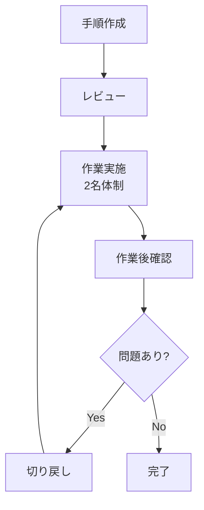

#### 準備する

- 手順をコマンドレベルで記載する
- 手順に切り戻し方法も含める（問題があった場合速やかに対応できるように）
- 作業前後の確認を意識する
  - ファイルであれば `diff` で差分をチェック
  - ansibleであれば `-C` つきで差分を確認
- レビューを受ける（有識者のレビューを受け、手順に誤りがないことを確認）

#### 作業する

- 本番作業は2名体制で実施する
- 問題発生時に切り戻す体制を整える

#### 作業後

- playbookを流しておわりではなく、流した結果の動作を確認する
- 既存サービスへの追加作業であれば、既存サービスに影響を与えていないことを確認する

## 命名規則

### Host Domain Name Rule

例: `wbb0102a`（本番 b2b サイト用 web サーバ1番最初につくった、2号機）

命名規則を分解すると:

```
w   bb   01   02   a
│    │    │    │   └── サブ識別子（a=1号機, b=2号機...）
│    │    │    └────── 連番（02=2台目）
│    │    └─────────── グループ番号（01=最初に作った組）
│    └──────────────── サービス名（bb=b2b）
└───────────────────── 役割（w=web）
```

> ホスト名を見ただけで「何のサーバーか」がわかるようにするのが命名規則の目的。チーム内で統一ルールを決めておくことで、障害対応時に素早く対象を特定できる。

### スケールアップとスケールアウト

両方とも目的としては出力を上げること。

```mermaid
graph LR
    subgraph スケールアップ（垂直）
        A1[サーバー] -->|パワーアップ| A2[強いサーバー]
    end
    subgraph スケールアウト（水平）
        B1[サーバー1]
        B2[サーバー2]
        B3[サーバー3]
    end
```

| 種類 | 説明 | 別名 |
|------|------|------|
| スケールアップ | Aさんがキントレしてパワーアップ | 垂直スケール |
| スケールアウト | Bさんという仲間を増やす | 水平スケール |

## インフラエンジニアがよく使うツール

- **Linux OS**: 仮想での環境が多い
- **Terminal**: Linuxを操作するための入力する道具（黒い画面）。シェル(貝)ともいう

## ファイル転送

### プロトコルとは

お互いにやりとりするための共通の言葉（ルール/規約）のこと。

> **たとえ話**: 日本人同士は日本語で会話する。英語圏の人とは英語で会話する。「何語で喋るか」がプロトコルにあたる。コンピュータも通信相手と同じプロトコルを使わないと通じない。

代表的なプロトコルとポート:

| プロトコル | ポート | 何をする？ |
|-----------|--------|-----------|
| HTTP | 80 | Webページを表示する（暗号化なし） |
| HTTPS | 443 | Webページを表示する（暗号化あり） |
| SSH | 22 | リモートで安全にサーバーに接続する |
| FTP | 21 | ファイルを送受信する |
| DNS | 53 | ドメイン名をIPアドレスに変換する |
| SMTP | 25 | メールを送信する |

### ファイル転送プロトコル

| プロトコル | port | 特徴 |
|-----------|------|------|
| ftp | 21 | 古い。暗号化されていない。絶滅寸前 |
| sftp | 22 | 暗号化されている。主流 |
| rsync | - | 同期（sync）ができる。暗号化の有無を選択可能 |

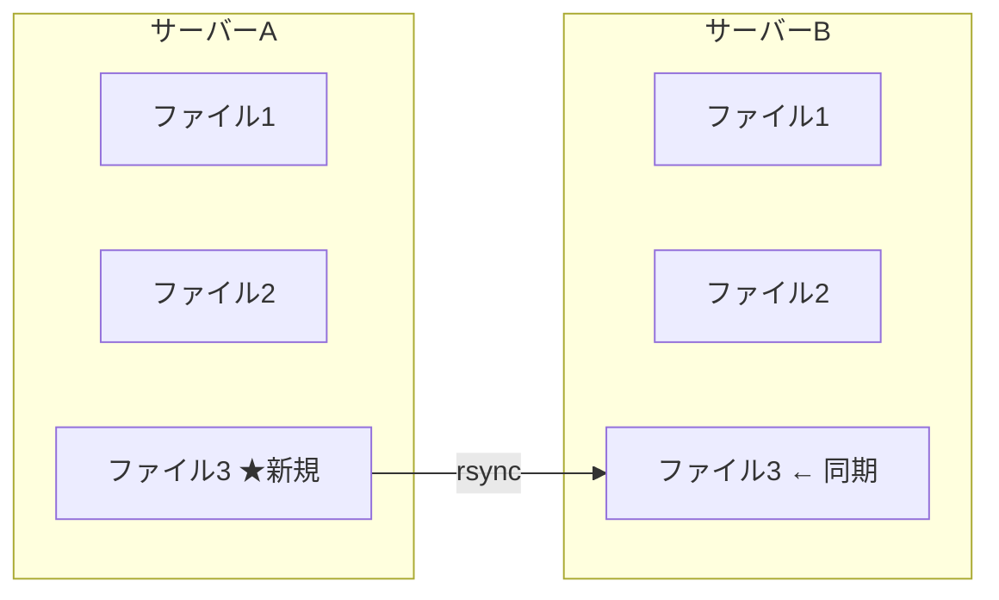
| ftps | 989,990 | ほぼ使っている人はいない |

### sftp の使い方

```bash
sftp ubuntu@192.168.1.100
```

- `!` をつけると接続元、つけないと接続先を参照
- `mput ファイル名`: ファイルを送る
- `mget ファイル名`: ファイルを取得する

### GUIソフトウェア

- **WinSCP**: ftp, sftp, ftps どれでも利用可能
- **FFFTP**: ftp, sftp, ftps どれでも利用可能

## クラウド環境

### なぜクラウドというのか？

自宅や会社には設備(物理のマシン)は無いが、インターネット上のどこかで用意されたものを仮想的に利用する環境。インターネット = 雲(クラウド)で表現されることが慣例的にある。

- **AWS** (Amazon Web Service): 買い物のAmazonとは会社は同じだがサービスは別
- **GCP** (Google Cloud Platform): Googleが同じようなサービスをやっているもの

## Linuxの種類（ディストリビューション）

Linux にも種類がめちゃめちゃ多くある（1000種類くらい？）。オープンソースなので無料のものも多い。

### 有償

- Redhat Linux
- Oracle Linux
- Suse Linux

### 主な系統

| 系統 | 代表的なディストリビューション | 特徴 |
|------|------|------|
| SlackWare系 | - | 歴史があるが最近はあまりみかけない |
| Redhat (Fedora)系 | RHEL, CentOS, Rocky Linux, Alma Linux | データベースを動かすときによく選択される |
| Debian系 | **ubuntu** | 2024年現在もっとも流行っている |
| Gentoo系 | - | もっとも扱いが難しい |
| 独立系 | arch linux | - |

系統の違い = パッケージ管理の方法が違う（基本的なコマンドは一緒）

| 系統 | パッケージ管理コマンド | パッケージ形式 |
|------|---------------------|--------------|
| Redhat系 | `yum` / `dnf` | `.rpm` |
| Debian系 | `apt` | `.deb` |

```bash
# Debian系 (ubuntu) でnginxをインストールする場合
sudo apt update          # パッケージ一覧を最新化
sudo apt install nginx   # nginxをインストール

# Redhat系 (Rocky Linux) の場合
sudo dnf install nginx
```

参考: https://upload.wikimedia.org/wikipedia/commons/1/1b/Linux_Distribution_Timeline.svg

## プログラミング言語

### インフラエンジニアがよく使う言語

- **shell-script** (必須)
- **python**

#### ワンライナー

1行でやりたいことを手軽にプチ自動化すること。「一行野郎」とも呼ばれる。

```bash
# 例: "ほげほげ" を10回表示する
for i in $(seq 10); do echo "ほげほげ"; done

# 例: カレントディレクトリの.logファイルを全て削除
find . -name "*.log" -delete

# 例: あるファイルの中から "error" を含む行だけ表示
grep "error" /var/log/syslog
```

### インタプリタ vs コンパイラ

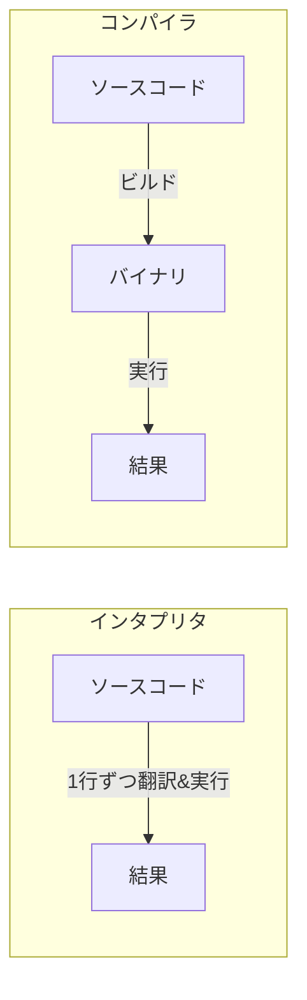

| 方式 | 特徴 | 例 |
|------|------|------|
| インタプリタ | ビルド不要。逐次翻訳しながら実行。遅いがプログラミングしやすい | python, bash, php |
| コンパイラ | 先にビルドして機械語に翻訳。速度が速い | c, java |

### 変数

```bash
a=b        # aという入れ物にbが入る
echo ${a}  # → b
```

**スコープ**: 変数がいつまで有効なのか？

| スコープ | 説明 | 設定例 |
|---------|------|--------|
| そのコマンド限り | 1回のコマンド実行中だけ有効 | `ENV=prod command` |
| シェルセッション限り | ユーザがログインしている間有効 | `export MY_VAR=hello` |
| 全ユーザ共通 | どのユーザでも参照できる | `/etc/environment` に記載 |
| 恒久的（個人） | ログインするたびに自動で設定される | `~/.bashrc` に記載 |

```bash
# シェルセッション限り（ターミナルを閉じたら消える）
export GREETING="hello"
echo $GREETING  # → hello

# 恒久的にしたい場合は ~/.bashrc に書く
echo 'export GREETING="hello"' >> ~/.bashrc
```

## ネットワークとは

### パケット

コンピュータ間でデータを送受信する際、データは「パケット」という小さな単位に分割されて送られる。

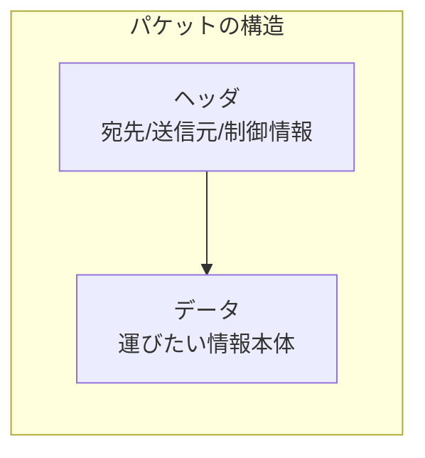

- 大きなファイルも小さなパケットに分割して送る（1つの道路を独占しないように）
- 各パケットにはヘッダ（宛先情報）が付いており、ネットワーク機器がこれを見て正しい宛先に届ける
- 届いた先でパケットを組み立て直して、元のデータに復元する

> **たとえ話**: 長い手紙を1枚ずつハガキに分けて送るようなもの。各ハガキに宛先と何枚目かが書いてあるので、届いた先で順番通りに並べれば元の手紙になる。

### IPアドレス

インターネット上の機器が互いに通信する際に識別するためのアドレス。

- **IPv4**: 約43億個 (2の32乗) — 3桁が4つ、1区切りの最大値が255
- **IPv6**: 約340澗個 (2の128乗)

#### グローバルIPアドレス

- 全世界で一意(uniq)に割り当て
- インターネットに接続するときに必要
- 世界で同じものが1つとして無い（住所と同じ）

> IPv4のグローバルIPは約43億個しかない。大学や大企業が大量に確保してしまい枯渇問題がある。そのためIPv6が生まれた。ただしクラウドの台頭により、現在はそこまで急いで移行する雰囲気ではない。

#### プライベート(ローカル)IPアドレス

企業内、家庭内など閉じられた世界で使用する。インターネットへはグローバルIPへの変換（**NAT**: Network Address Translation）が必要。

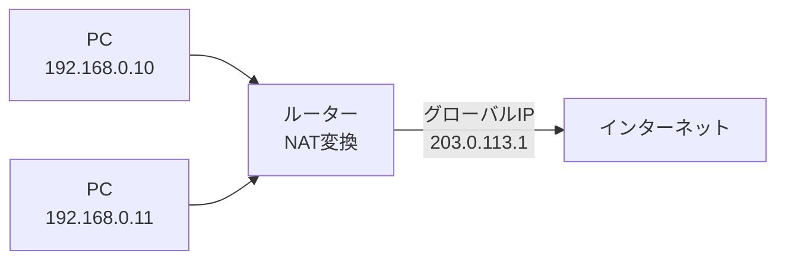

| 範囲 | ブロック |
|------|---------|
| 10.0.0.0〜10.255.255.255 | 24ビットブロック |
| 172.16.0.0〜172.31.255.255 | 20ビットブロック |
| 192.168.0.0〜192.168.255.255 | 16ビットブロック |

#### 特殊なIP

- `127.0.0.1`: 自分自身のホスト専用（他のホストからは通信できない）

### ドメインネーム

IPアドレスを人間がわかりやすいように表現しているもの。

例: `example.com` → `3.163.218.24` など

### DNS (Domain Name System)

ドメインとIPアドレスを変換する仕組み。

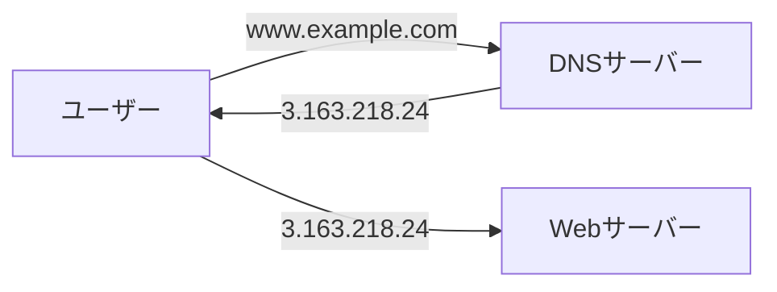

- **正引き**: ドメイン → IPアドレス
- **逆引き**: IPアドレス → ドメイン

```bash
dig www.example.com
```

### サブネットマスク

IPアドレスを「ネットワーク部」と「ホスト部」に分割するための数値。

> **たとえ話**: 住所でいうと「大阪府大阪市」がネットワーク部（どの地域か）、「○○町1-2-3」がホスト部（その地域のどの家か）にあたる。ネットマスクは「どこまでが地域名で、どこからが個別の家か」の区切りを決めるもの。

覚え方: ネットマスクが `255` のところは「ネットワーク部」、`0` のところは「ホスト部」。ホスト部の範囲が同じセグメント（=直接通信できる仲間）になる。

```bash
# 例1: 172.16.0.1 / 255.255.255.0 (/24)
#   ネットワーク部: 172.16.0
#   ホスト部: .1〜.254
# → 172.16.0.1〜172.16.0.254 が通信可能な範囲 (254台)

# 例2: 172.16.0.1 / 255.255.0.0 (/16)
#   ネットワーク部: 172.16
#   ホスト部: .0.1〜.255.254
# → 172.16.0.1〜172.16.255.254 が通信可能な範囲 (65,534台)

# 便利コマンド
apt install ipcalc
ipcalc 192.168.1.0/24
```

表記方法:
- `255.255.255.0` 形式（サブネットマスク）
- `/24` (CIDR表記) — マスクの `255`(=8bit) が何個あるか。/24 = 8x3 = 上位24ビットがネットワーク部

::: tip よく使うCIDR
| CIDR | サブネットマスク | ホスト数 | 用途例 |
|------|----------------|---------|--------|
| /32 | 255.255.255.255 | 1台 | 特定ホスト指定 |
| /24 | 255.255.255.0 | 254台 | 一般的なLAN |
| /16 | 255.255.0.0 | 65,534台 | 大規模ネットワーク |
| /8 | 255.0.0.0 | 約1,677万台 | 超大規模 |
:::

### ゲートウェイ

異なるネットワークを繋ぐ接続点。GW = ルーター（ルーティングの仕事をする機械）と考えてよい。

```mermaid
graph LR
    subgraph 地域A<br/>192.168.0.0/24
        A1[192.168.0.1]
        A2[192.168.0.2]
    end
    subgraph 地域B<br/>192.168.1.0/24
        B1[192.168.1.1]
        B2[192.168.1.2]
    end
    A1 & A2 <--> GW[ゲートウェイ<br/>ルーター]
    GW <--> B1 & B2
```

- GWが無くても通信できる範囲 = netmask(CIDR)で指定した範囲
- 異なるセグメント間の通信にはGWが必要

### ブロードキャスト

ネットワーク上の全ての機器に対して一度にデータを送ること。ブロードキャストIPアドレスは予約されており、機器間通信には利用できない。

> **たとえ話**: 教室で先生が「全員聞いて！」と言うのがブロードキャスト。特定の生徒に話しかけるのがユニキャスト（通常の通信）。
>
> 例: `192.168.0.0/24` のネットワークでは `192.168.0.255` がブロードキャストアドレス。この宛先に送ったデータは、そのセグメントの全機器が受け取る。

### ポート

IPアドレスが「建物の住所」だとすると、ポートは「部屋番号」にあたる。1つのサーバー（1つのIPアドレス）で複数のサービスを同時に動かすために、ポート番号で区別する。

| ポート番号 | サービス | 用途 |
|-----------|---------|------|
| 22 | SSH | リモート接続 |
| 80 | HTTP | Webサイト（暗号化なし） |
| 443 | HTTPS | Webサイト（暗号化あり） |
| 21 | FTP | ファイル転送 |
| 25 | SMTP | メール送信 |
| 53 | DNS | 名前解決 |
| 3306 | MySQL/MariaDB | データベース |

well Known Port 一覧: https://www.infraexpert.com/study/tea5.htm

> portが無い世界だったら… 1つのサービスに1つのIPが必要になっていたかも。

::: tip ポート番号の範囲
- **0〜1023**: Well Known Port（有名なサービスが使う予約済みの番号）
- **1024〜49151**: 登録済みポート（アプリケーションが登録して使う）
- **49152〜65535**: 動的ポート（一時的な通信に自動で割り当てられる）
:::

### OSI参照モデル

ネットワークの通信機能を7階層に分けてモデル化。通信の仕組みを理解するための「教科書的な分類」であり、実際の通信はTCP/IPモデル（4層）で動いていることが多い。

| 層 | 名称 | 役割 | 例 |
|----|------|------|-----|
| 7 | アプリケーション層 | アプリの具体的機能 | http, ftp, smtp, dns |
| 6 | プレゼンテーション層 | データの表現形式（暗号化、圧縮） | SSL/TLS, JPEG, gzip |
| 5 | セッション層 | 通信の開始〜終了の管理 | NetBIOS |
| 4 | トランスポート層 | 通信品質コントロール（到達保証） | TCP/UDP |
| 3 | ネットワーク層 | 通信経路の選択・中継（ルーティング） | IP, ICMP |
| 2 | データリンク層 | 直接接続された機器同士の通信 | イーサネット, Wi-Fi |
| 1 | 物理層 | 電気信号・光信号など物理的な通信 | LANケーブル, 光ファイバー |

> **覚え方**: 「あ(7)・プ(6)・セ(5)・ト(4)・ネ(3)・デ(2)・ブ(1)」— 上から順に頭文字を取る。
>
> インフラエンジニアが特に意識するのは L2〜L4 あたり。「L3スイッチ」「L4ロードバランサ」のようにレイヤー番号をつけて呼ぶことが多い。

### TCP/IP

| プロトコル | 層 | 特徴 | 用途 |
|-----------|-----|------|------|
| TCP (L4) | トランスポート層 | 確実にデータを送り届ける。ステートフル | Web, メール, ファイル転送 |
| UDP (L4) | トランスポート層 | すばやく送る。ステートレス。再送制御なし | 音声, 動画ストリーミング, DNS |

::: tip ステートフルとステートレス
- **ステートフル (TCP)**: 「今、通信中ですよ」という状態を双方が覚えている。データが届かなかったら再送する。確実だが遅い。
  - たとえ: 電話（相手が聞いてるか確認しながら話す）
- **ステートレス (UDP)**: 送りっぱなし。届いたかどうか確認しない。速いが不確実。
  - たとえ: 手紙を投函（届いたかは確認しない）

動画通話で一瞬映像が乱れても、前の映像を再送されても意味がない。だからUDPが使われる。
:::

### ロードバランサ

L4またはL7でネットワークの経路を制御する装置。

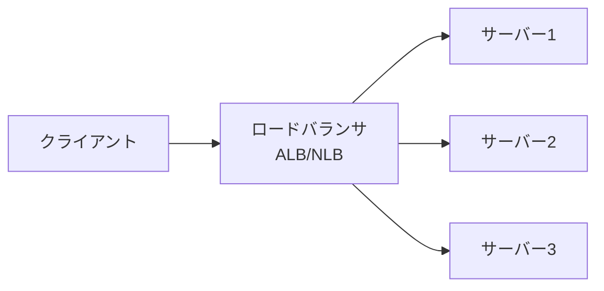

なぜサーバーが1台ではダメなのか？
- **負荷分散**: 利用者が多いから（1台だと処理が追いつかない）
- **耐障害性**: 1台が壊れてもサービスが止まらないように
- **メンテナンス性**: 1台ずつ順番にアップデートできる

| 種類 | OSI層 | 分散の判断基準 | AWSでの名前 |
|------|------|--------------|------------|
| L4ロードバランサ | トランスポート層 | IPアドレスとポート番号 | NLB (Network LB) |
| L7ロードバランサ | アプリケーション層 | URLパスやHTTPヘッダー | ALB (Application LB) |

### FW / SG (ファイアウォール / セキュリティグループ)

どちらもFireWallのこと。AWSではSecurityGroupと呼ぶ。

ファイアウォールとは、ネットワークの通信を制御する「門番」のようなもの。許可されたポートや通信元からの通信だけを通し、それ以外はブロックする。

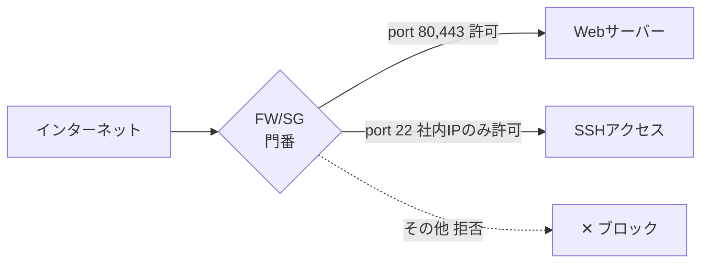

設定例（考え方）:
- 「Webサーバーには誰でもHTTPS (443) でアクセスできる」
- 「SSHは社内のIPアドレスからのみ許可」
- 「データベースのポート (3306) はWebサーバーからのみ許可」

## AI・開発環境の整備

### 生成AI

#### 会社

- monochat (slack: @MonoChat)
- Gemini: https://gemini.google.com/app
- NotebookLM: https://notebooklm.google.com (RAG)

#### 自宅で無料

- Gemini
- NotebookLM

#### 有償AIツール（2026年4月時点でExampleCorpで利用）

- **Claude** (Claude.ai, Claude code)
- **Cursor**: AI特化型IDE
- **Devin**: 自律型AI Agent
- **ChatGPT / Codex**
- **Perplexity**

### キーボード: Caps → Ctrl 入れ替え

```reg
Windows Registry Editor Version 5.00
[HKEY_LOCAL_MACHINE\SYSTEM\CurrentControlSet\Control\Keyboard Layout]
"Scancode Map"=hex:00,00,00,00,00,00,00,00,02,00,00,00,1d,00,3a,00,00,00,00,00
```

管理者権限のDOS窓から:

```cmd
reg import caps.reg
```

### 物理マシン

- 自宅で1万円程度のノートパソコンを買う（アマゾン整備品、メモリ8GB程度）
- Linuxをインストールする

## OS まとめ

OSはハードウェアを管理し、アプリケーションがハードウェアを効率的に安全に利用できるように制御するソフトウェア。

- **Windows** / **Mac** (ベースBSD)
- **Linux**: コマンドでやりたいことを命令する

### ミドルウェア

OSの上で動くソフト（OSが無いと動かない）。OSとアプリケーションの間に位置する。

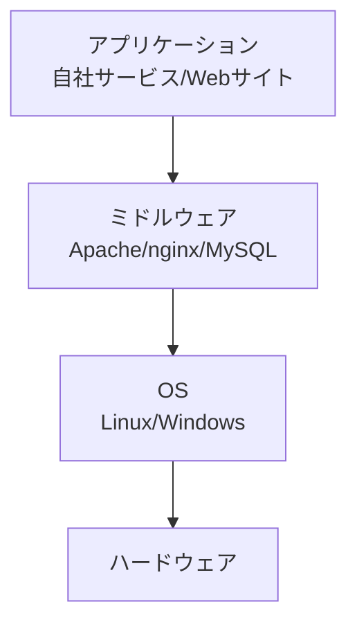

| 種類 | 代表的なミドルウェア | 役割 |
|------|---------------------|------|
| Webサーバー | Apache, nginx | HTTPリクエストを受けてページを返す |
| データベース | MySQL, MariaDB, PostgreSQL | データを保存・検索する |
| キャッシュ | Redis, Memcached | 頻繁にアクセスされるデータを高速に返す |

> 一般的に「ミドルウェア」と聞くと上記のようなサーバーソフトを指すことが多い。slack, word, zoom なども広義にはOSの上で動くソフトウェアだが、これらは「アプリケーション」と呼ばれることが多い。

### 仮想マシン環境

- Windows: WSL
- Linux: vmware, vcenter, proxmox(OSS)
- AWS/GCP: EC2

### ヒアドキュメント

標準入力を使って複数行をファイルに書き込む方法。設定ファイルを作るときに便利。

```bash
# 上書き（既存の内容は消える）
cat > fukusugyo.txt << 'EOF'
1行目の内容
2行目の内容
EOF

# 追記（既存の内容の後ろに追加）
cat >> fukusugyo.txt << 'EOF'
追加する内容
EOF
```

::: warning 注意
`>` が1個だと**上書き**、`>>` だと**追記**。上書きすると元の内容が消えるので注意！
:::

## プログラミング言語の種類

| 言語 | 特徴 |
|------|------|
| C言語 | 難しい。apache, nginx, MariaDB等はこれで書かれている |
| HTML | ホームページ作成に特化 |
| Python | ExampleCorpで使用。何でもできる |
| PHP | HP作成が得意、バッチ |
| Ruby | 日本人作者。優しいとされている |
| shell-script | shell操作に特化。インフラエンジニア向け |
| Java | 何でもできる |
| Go | 何でもできる |
| JavaScript | - |
| C# | ゲーム、web、スマホアプリなど何でも |

## IDE とエディタ

### IDE (Integrated Development Environment)

エディタの凄い版。様々なプログラミングの支援をする:

- 補完: 途中まで入力したらいい感じに書いてくれる
- デバッガー: バグを検知して教えてくれる
- フォーマッター: 段落・字下げなどを統一
- リンター: 世間一般的な作法を適用

#### 具体的なツール

- **VSCode**: マイクロソフト製、無料
- **Eclipse**: OSS、無料 (Java)
- **IntelliJ**: JetBrains社、有償
- **Cursor**: AI支援特化、有料

### エディタ

文書を新規作成、編集するもの。

#### Vim

- Linux の標準的なメモ帳
- 止め方: `:q`（変更を保存せず終了）、`:wq`（保存して終了）、`:q!`（強制終了）

**2つのモード:**

| モード | 説明 | 切替方法 |
|--------|------|----------|
| ノーマルモード | カーソル移動、コピペ、検索、保存 | ESC または Ctrl+[ |
| 挿入モード | 文字を書く | i, o, O, a, A |

**ノーマルモードでよく使うキー:**

| キー | 動作 |
|------|------|
| `h` `j` `k` `l` | 左・下・上・右に移動（矢印キーでも可） |
| `dd` | 1行削除（カット） |
| `yy` | 1行コピー（ヤンク） |
| `p` | 貼り付け（ペースト） |
| `u` | 元に戻す（undo） |
| `/検索語` | 文字列を検索 |
| `:w` | 保存 |
| `:wq` | 保存して終了 |
| `:q!` | 保存せずに強制終了 |
| `gg` | ファイルの先頭に移動 |
| `G` | ファイルの末尾に移動 |

```bash
vim hoge.txt    # ファイルを開く（なければ新規作成）
vimtutor ja     # チュートリアル（まずこれをやるべし）
```

::: warning 初心者あるある
vimを起動して文字が打てない！ → `i` を押して挿入モードに入る。
vimを終了できない！ → `ESC` を押してから `:q!` で強制終了。
:::

## VSCode

- Windows, Linux, Macで動く万能で無料なエディタ
- プラグインが豊富で何でも開発できる
- DL: https://code.visualstudio.com/

### インストール

パッケージマネージャ推奨:
- Windows: `winget`
- Linux: `apt` (msのリポジトリ追加が必要)
- Mac: `homebrew`

### おすすめプラグイン

- Japanese Language Pack
- Error Lens
- VSCode Icons
- IntelliCode
- Remote Development

### SSH リモート開発

VSCodeを使ってサーバー環境にSSHリモート接続可能。

### プロキシ設定（会社の場合）

接続先ホストで以下を実行:

```bash
cat << 'EOT' >> ~/.bashrc
export HTTP_PROXY=http://proxy.onaka.example.com:3128
export HTTPS_PROXY=http://proxy.onaka.example.com:3128
EOT
```

## XaaS (IaaS / PaaS / SaaS)

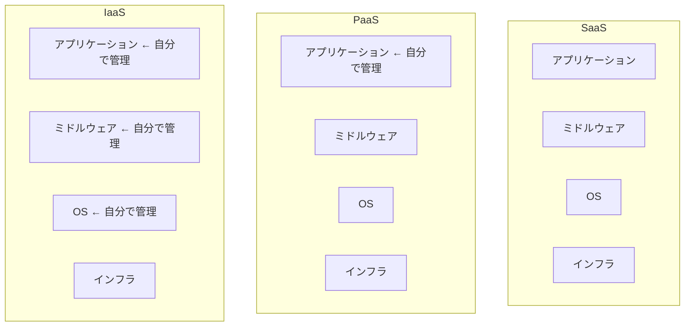

| サービス | 読み方 | 提供されるもの | 自由度 |
|---------|--------|---------------|--------|
| IaaS | イアース | インフラ（仮想サーバー、ネットワーク） | 高い/難しい |
| PaaS | パース | プラットフォーム（開発環境） | 中程度 |
| SaaS | サース | ソフトウェア（完成品） | 低い/簡単 |

### 具体例

- **SaaS**: Gmail, Slack, Salesforce, Zoom
- **PaaS**: Google App Engine, AWS Elastic Beanstalk
- **IaaS**: Amazon EC2, Google Compute Engine

### WordPressで理解するXaaS（家づくりのたとえ）

| サービス | 家づくりの例え | WordPress環境での利用形態 |
|---------|--------------|------------------------|
| IaaS | 🌳 更地（土地）を借りる | AWS EC2にOS/Apache/PHP/MySQLを自分で入れてWordPressを構築 |
| PaaS | 🔨 プレハブの家を借りる | Xserver, ConoHa WING などのマネージドホスティング |
| SaaS | 🛋️ 家具付きマンションを借りる | WordPress.com（すぐ使える。カスタマイズ制限あり） |

IaaSは自由度が高いが全部自分でやる必要がある。SaaSは簡単だがカスタマイズが制限される。

## 読み方辞典

| 表記 | 読み方 |
|------|--------|
| vi | ぶいあい |
| wget | ダブルゲット |
| ping | ぴん |
| etc | エトセ |
| opt | オプト |
| var | ばー |
| apache2 | アパッチ2 |
| nginx | エンジンエックス |
| DB | デービー |

## 用語辞典

### WordPress

- CMS (Contents Management Systems): 簡単にホームページを作れるもの
- オープンソース

### OSS (Open Source Software)

- タダで使えるもの
- LinuxというOSがOSSに親和性が高い
